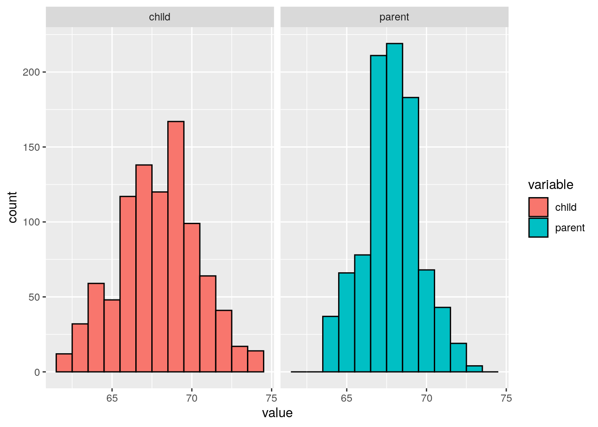
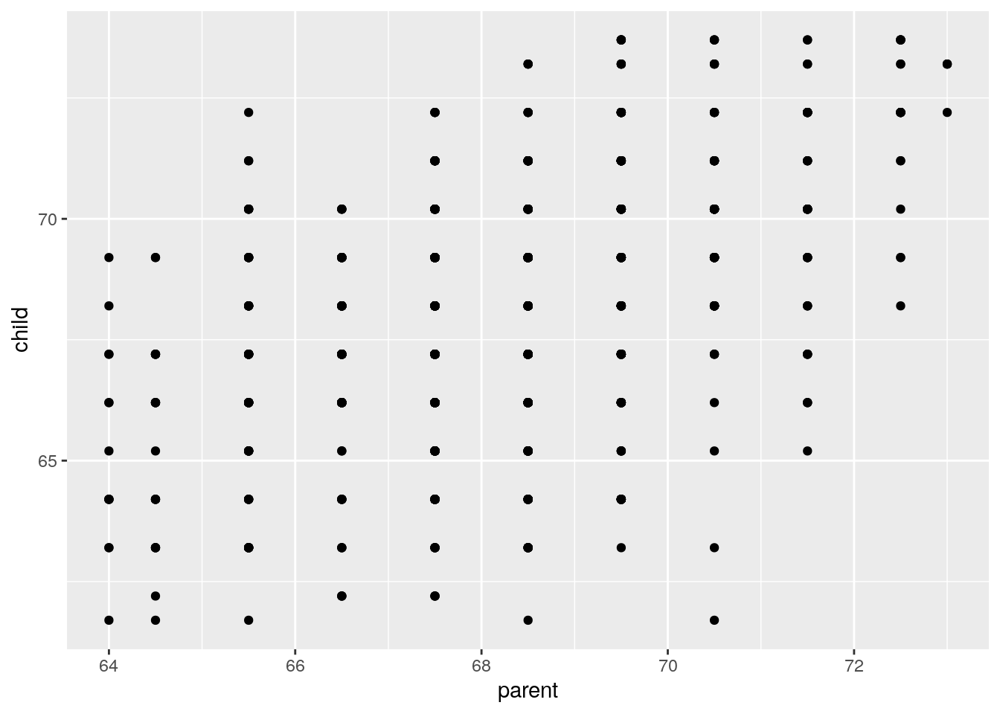
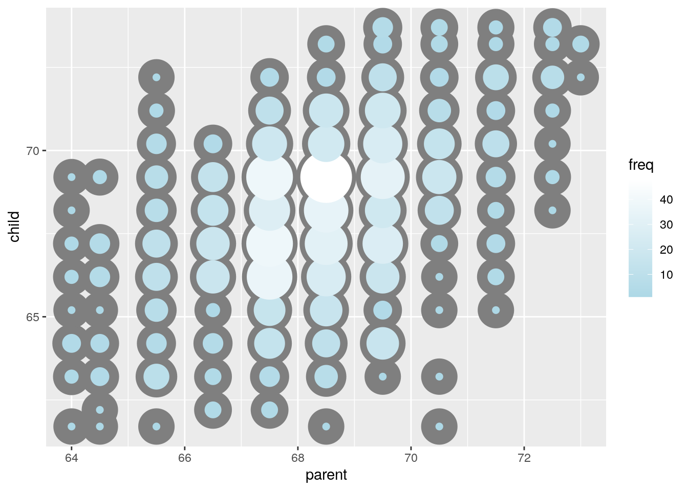
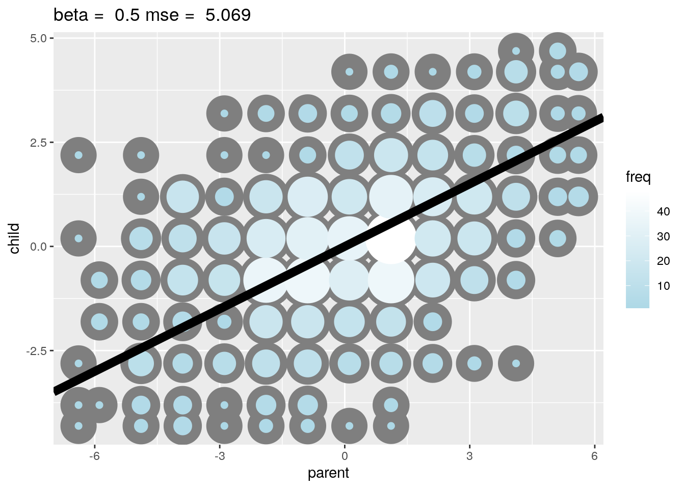
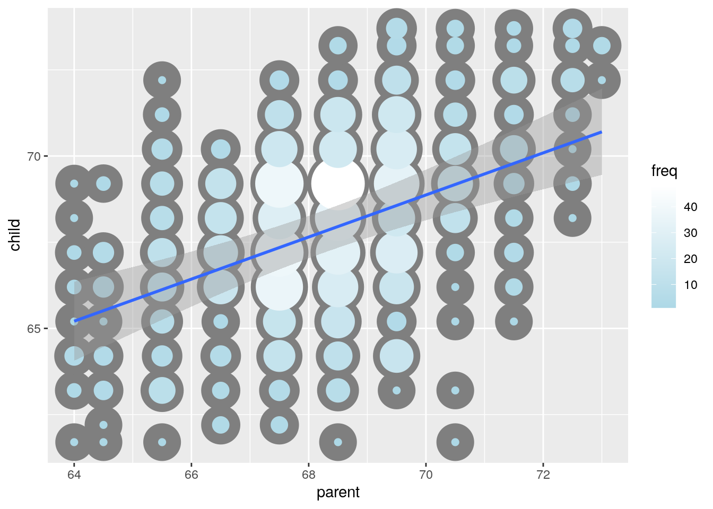
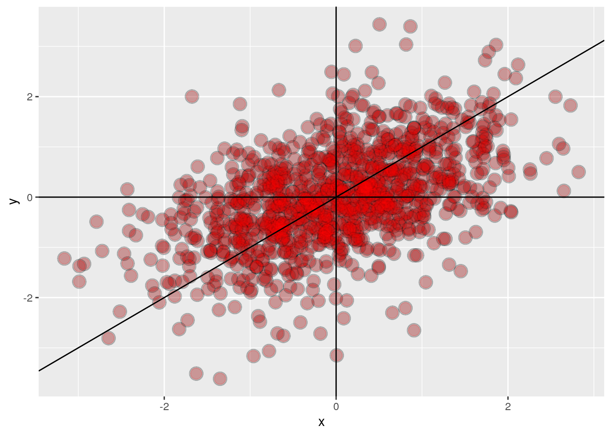
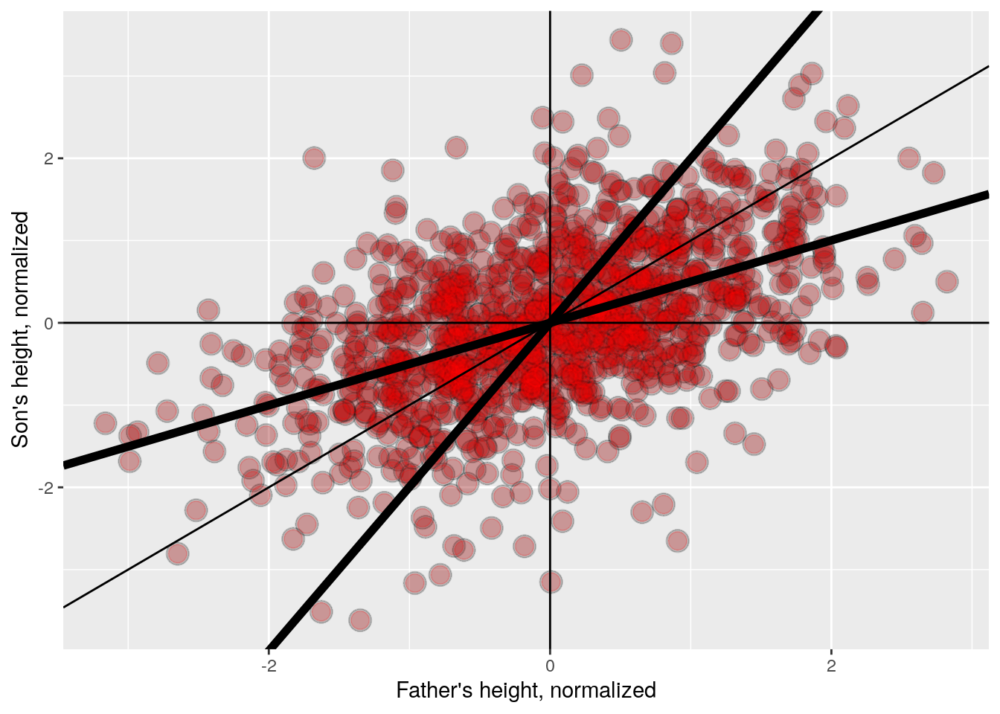

```
## Installing package into '/usr/local/lib/R/site-library'
## (as 'lib' is unspecified)
```

```
## also installing the dependencies 'jpeg', 'checkmate', 'Formula', 'latticeExtra', 'gridExtra', 'htmlTable', 'viridis', 'HistData', 'Hmisc'
```

```
## Installing package into '/usr/local/lib/R/site-library'
## (as 'lib' is unspecified)
```

```
## also installing the dependency 'plyr'
```

```
## Installing package into '/usr/local/lib/R/site-library'
## (as 'lib' is unspecified)
## Installing package into '/usr/local/lib/R/site-library'
## (as 'lib' is unspecified)
```

```
## Loading required package: MASS
```

```
## Loading required package: HistData
```

```
## Loading required package: Hmisc
```

```
## Loading required package: lattice
```

```
## Loading required package: survival
```

```
## Loading required package: Formula
```

```
## Loading required package: ggplot2
```

```
## 
## Attaching package: 'Hmisc'
```

```
## The following objects are masked from 'package:base':
## 
##     format.pval, units
```

```
## 
## Attaching package: 'UsingR'
```

```
## The following object is masked from 'package:survival':
## 
##     cancer
```

```
## Warning: package 'reshape' was built under R version 4.0.3
```


# Week 01

## Introduction

### Welcome to Regression Models

I am happy that you've chosen to take Regression Models, part of the Johns Hopkins Data Science Specialization on Coursera! This course presents the fundamentals of regression modeling that you will need for the rest of the specialization and ultimately for your work in the field of data science.

We believe that the key word in Data Science is "science". Our course track is focused on providing you with three things: (1) an introduction to the key ideas behind working with data in a scientific way that will produce new and reproducible insight, (2) an introduction to the tools that will allow you to execute on a data analytic strategy, from raw data in a database to a completed report with interactive graphics, and (3) on giving you plenty of hands on practice so you can learn the techniques for yourself.

Regression Models represents a both fundamental and foundational component of the series, and it presents the single most practical data analysis toolset. Using only a bare minimum of mathematics, we will attempt to provide you with the fundamentals for the application and practice of regression.

We are excited about the opportunity to attempt to scale Data Science education. We intend for the courses to be self-contained, fast-paced, and interactive, and we intend to run them frequently to give people with busy schedules the opportunity to work on material at their own pace.

### Some Basics

A couple of first week housekeeping items. First, make sure that you've had [R Programming](https://www.coursera.org/learn/r-programming) , the [Data Scientist's Toolbox](https://www.coursera.org/learn/data-scientists-tools), [Reproducible Research](https://www.coursera.org/learn/regression-models/supplement/uCPA0/welcome-to-regression-models) and [Statistical Inference](https://www.coursera.org/learn/statistical-inference) before taking this class. At a minimum you must know: very basic git, basic R and most of the Statistical Inference Coursera class. The small amount of knitr that you need for the project you can pick up quickly.

An important aspect of this class is to peruse the materials in the github repository. All of the most up to date material can be found [here](https://github.com/bcaffo/courses/tree/master/07_RegressionModels). You should clone this repository as your first step in this class and make sure to fetch updates periodically. (Please issue pull requests so that we may improve the materials!) It is one of the most essential components of the Specialization that you start to use Git frequently. We're practicing what we preach as well by using the tools in the series to create the series, especially git. Note my [GitHub repo](https://github.com/bcaffo/courses) will generally be more up to date than the Data Science Specialization Repo.

The lectures are in the index.Rmd lecture files. In [Developing Data Products](https://www.coursera.org/learn/data-products), we cover how to create these sorts of slides. However, for the time being, you should be able to open them in R Studio and look at their contents. You will see all of the R code to recreate the lectures. Going through the R code is the best way to familiarize yourself with the lecture materials.

#### YouTube
If you'd prefer to watch the videos on YouTube, you can find them [here](https://www.youtube.com/playlist?list=PLpl-gQkQivXjqHAJd2t-J_One_fYE55tC) and [here](https://www.youtube.com/playlist?list=PLpl-gQkQivXhdgUCdaUQcdb31CRe8Mm2y).
If you'd like to keep up with the instructors I'm @bcaffo on twitter, Roger is @rdpeng and Jeff is @jtleek. The Department of Biostat here is @jhubiostat.


### Syllabus (xxx)

Course Title: Regression Models

Course Instructor(s):The primary instructor of this class is [Brian Caffo](https://sites.google.com/view/bcaffo/home/).
Brian is a professor at Johns Hopkins Biostatistics and co-directs the [SMART working group](https://www.smart-stats.org).

This class is co-taught by Roger Peng and Jeff Leek. In addition, Sean Kross and Nick Carchedi have been helping greatly.

#### Course Description:

Linear models, as their name implies, relates an outcome to a set of predictors of interest using linear assumptions. Regression models, a subset of linear models, are the most important statistical analysis tool in a data scientist's toolkit. This course covers regression analysis, least squares and inference using regression models. Special cases of the regression model, ANOVA and ANCOVA will be covered as well. Analysis of residuals and variability will be investigated. The course will cover modern thinking on model selection and novel uses of regression models including scatterplot smoothing.

#### Course Content

This class has three main components:

- Least squares and linear regression
- Multivariable regression
- Generalized linear models

The full list of topics are as follows:

- Module 1, least squares and linear regression
- - 01_01 Introduction
- - 01_02 Notation
- - 01_03 Ordinary least squares
- - 01_04 Regression to the mean
- - 01_05 Linear regression
- - 01_06 Residuals
- - 01_07 Regression inference

- Module 2, Multivariable regression
- - 02_01 Multivariate regression
- - 02_02 Multivariate examples
- - 02_03 Adjustment
- - 02_04 Residual variation and diagnostics
- - 02_05 Multiple variables

- Module 3, Generalized linear models
- - 03_01 GLMs
- - 03_02 Binary outcomes
- - 03_03 Count outcomes
- - 03_04 Olio

- Module 4, Logistic Regression and Poisson Regression
- - 04_01 Logistic Regression
- - 04_02Poisson Regression
- - 04_03 Hodgepodge


#### Book: Regression Models for Data Science in R. 

A companion book is available [here](https://leanpub.com/regmods). The book is published via leanpub, and the suggested price is $14.99. You can get it for free or pay what you feel it is worth.

#### Quizzes

There are four weekly quizzes. You must earn a grade of at least 80% to pass a quiz. You may attempt each quiz up to 3 times in 8 hours. The score from your most successful attempt will count toward your final grade.

#### Course Project

The Course Project is an opportunity to demonstrate the skills you have learned during the course. It is graded through peer assessment. You must earn a grade of at least 80% to pass the peer assessment.

#### Grading Policy

You must score at least 80% on all assignments (Quizzes & Project) to pass the course.

Your final grade will be calculated as follows:

Quiz 1 = 15%
Quiz 2 = 15%
Quiz 3 = 15%
Quiz 4 = 15%
Course Project = 40%


##### swirl Programming Assignment (optional)

In this course, you have the option to use the [swirl](https://swirlstats.com) R package to practice some of the concepts we cover in lectures.

While these lessons will give you valuable practice and you are encouraged to complete as many as possible, please note that they are completely optional and you can get full marks in the class without completing them.

#### Differences of opinion

Keep in mind that currently data analysis is as much art as it is science - so we may have a difference of opinion - and that is ok! Please refrain from angry, sarcastic, or abusive comments on the message boards. Our goal is to create a supportive community that helps the learning of all students, from the most advanced to those who are just seeing this material for the first time.

### Data Science Specialization Community Site
Since the beginning of the Data Science Specialization, we've noticed the unbelievable passion students have about our courses and the generosity they show toward each other on the course forums. A couple students have created quality content around the subjects we discuss, and many of these materials are so good we feel that they should be shared with all of our students.

We're excited to announce that we've created a site using [GitHub Pages](http://datasciencespecialization.github.io/) to serve as a directory for content that the community has created. If you've created materials relating to any of the courses in the Data Science Specialization, please send us a pull request so we can add a link to your content on our site. You can find out more about contributing [here.](https://github.com/DataScienceSpecialization/DataScienceSpecialization.github.io#contributing)

We can't wait to see what you've created and where the community can take this site!

### Where to get more advanced material
If you want more advanced material, I've been working on another version of this class. Eventually I hope to have a second Coursera class as well. Currently, you can get the E-Book in progress [here](https://leanpub.com/lm) (it's variable pricing including free!)

In addition, you can watch the videos as they're being developed [here.](https://www.youtube.com/playlist?list=PLpl-gQkQivXhdgUCdaUQcdb31CRe8Mm2y)


## Introduction to regression and least squares
Regression models are the workhorse of data science. They are the most well described, practical and theoretically understood models in statistics. A data scientist well versed in regression models will be able to solve an incredible array of problems.

Perhaps the key insight for regression models is that they produce highly interpretable model fits. This is unlike machine learning algorithms, which often sacrifice interpretability for improved prediction performance or automation. These are, of course, valuable attributes in their own rights. However, the benefit of simplicity, parsimony and intrepretability offered by regression models (and their close generalizations) should make them a first tool of choice for any practical problem.

### Introduction to Regression
Hello, I'm Brian Caffo, and I'd like to welcome you to the introduction to regression lecture in the regression Coursera class, part of our data science specialization. Co-taught by my colleagues Jeff Leek and Roger Peng, we all belong to the Department of Biostatistics at the Johns Hopkins Bloomberg School of Public Health.

Regression is a cornerstone for data scientists. Before delving into complex machine learning, linear regression or its generalization, linear models, are often the go-to procedures. The roots of regression trace back to Francis Galton, who coined the term and concept, along with correlation, closely tied to linear regression.

Galton's prediction of a child's height from a parent's height remains historically significant. Jeff Leek [highlights](https://www.nature.com/articles/ejhg20095) its continued relevance in modern genetic analysis, comparing it to Victorian Era measurements. Moving to a more contemporary example, a blog post by Rafael Irazarry on Simply Statistics explores the relationship between Kobe Bryant's ball-hogging and the Lakers' performance, utilizing linear regression.

In a modern example, [Simply Statistics](https://simplystatistics.org) blog talks about "[the Lakers wins](https://simplystatistics.org/posts/2013-01-28-data-supports-claim-that-if-kobe-stops-ball-hogging-the-lakers-will-win-more/)" that Data supports claim that if Kobe stops ball hogging the Lakers will win more.The heart of our class is understanding how to formulate and interpret statements like for example in the Simply Statistics blog post "Linear regression suggests an increase of 1% in the percent of shots taken by Kobe results in a drop of 1.16 points." We'll delve into good statistical practices, including providing standard errors.

We might want to find a parsimonious and easily described mean relationships between the parent's and child's height. So we don't want anything complicated. We want the simplest possible relationship, and that is what regression is best at. While machine learning and other techniques generate highly elaborate, in many cases, accurate prediction models, they tend to not be parsimonious. They tend not to explain the data, and they tend not to generate new parsimonious knowledge, whereas this is what regression is good at. This is what regression is in fact best at. We can talk about variation that's unexplained by the regression model. The so called residual variation.

We're going to connect the results back to the subject of inference. How do we take our data, which is just a sample, it only talks about that data set, and try to figure out what assumptions are needed to extrapolate it to a larger population. This is a deep subject called statistical inference. We have a whole another course of Statistical Inference as part of data science specialization. But we're going to apply the tools of inference, which we are hoping most of you will have had as a prerequisite. We're going to apply the tools of inference to this new subject of regression.

Let's look at Francis Galton's data, he first used this data in 1885. He's really an interesting character in history, in general and definitely in the history of statistics. You need to run `install.packages("UsingR")`. Here `UsingR` is the package for the book, [Using R for Introductory Statistics](https://cran.r-project.org/doc/contrib/Verzani-SimpleR.pdf). It is a great book, and they've very kindly packaged all these data sets together in a single R package. So you need to use `UsingR` then the library `UsingR` to get a lot of the data sets that we are going to talk about. So let's first look at the marginal distribution of the parents. In other words, distribution of
the parents disregarding children. And the marginal distribution of the children, disregarding parents. 


```r
install.packages("UsingR")
```

Parent distribution is all heterosexual couples, correcting for sex by multiplying the female heights by 1.08. 


```r
library(UsingR); data(galton); library(reshape); long<-melt(galton);
```

```
## Using  as id variables
```

```r
g<- ggplot(long, aes(x=value, fill=variable)) 
g<- g+ geom_histogram(color='black', binwidth=1)
g<- g+ facet_grid(.~variable)

g
```



On the left, we have the children's heights. The X-axis is in inches, the scale goes from 60 inches to 75. The Y-axis is the count, the number of children that fall in each bin of heights. On the right in the more bluish teal color, we have the parents heights. We've broken the association by the children and the parents by not doing a scatter plot, and only looking at the marginal distribution of the children, and the marginal distribution of the parents by themselves. We would like to use these distributions to introduce least squares, and then we'll build on the bivaried association after that. So consider only the child's height,forget for the moment about using the parent's height to predict the child's heights. We just want to find maybe the best prediction of the child's heights without any other information. Well, probably the best predictor would be the middle and how could one define the middle? 

One definition, let $y_i$, be the height for child $i$, where in this dataset $i=1,2,...,n=928$. So the middle is the value of$\mu$ that minimizes $$\sum_{i=1}^n(y_i-\mu)^2$$

That's how we define the middle. It's also related to physics in this so called physical center of mass of the histogram that we showed on the previously. 
Imagine of those bars as being physical entities, having weight and you are trying to figure out where you would put your finger to balance it out. That would be the physical center of mass. You might have guessed that the center of the data has to be the mean. 

Let's use our studio's `manipulate` function to experiment with trying to find that center of mass. 


```r
library(manipulate) 
myHist<-function(mu){
    mse<-mean((galton$child - mu)^2)
    g <- ggplot(galton, aes(x = child)) + geom_histogram(fill = "salmon", colour = "black", binwidth=1)
    g <- g + geom_vline(xintercept = mu, size = 3)
    g <- g + ggtitle(paste("mu = ", mu, ", MSE = ", round(mse, 2), sep = ""))
    g
}
manipulate(myHist(mu),mu=slider(62,74,step=0.5))
```

fig xxx

Because we're using manipulate we can move the slider around and monitor the value of $\mu$ and
the mean squared error, that is the sum of the squared distances between the observed data points and that particular value of $\mu$. If you move the slider around, you would notice notice as we get toward the center of the histogram, the mean squared error is going down and if you keep moving the slider way up, it get's up large again. You can see $\mu$ is the point that balanced out this histogram.

**Notice**
For those that are interested, we cover some simple proofs of some of the statements made. If this isn't your thing, just skip these sections. However, if you're interested, get a pencil and paper to work along!

$$ 
\begin{align} 
\sum_{i=1}^n (Y_i - \mu)^2 & = \
\sum_{i=1}^n (Y_i - \bar Y + \bar Y - \mu)^2 \\ 
& = \sum_{i=1}^n (Y_i - \bar Y)^2 + \
2 \sum_{i=1}^n (Y_i - \bar Y)  (\bar Y - \mu) +\
\sum_{i=1}^n (\bar Y - \mu)^2 \\
& = \sum_{i=1}^n (Y_i - \bar Y)^2 + \
2 (\bar Y - \mu) \sum_{i=1}^n (Y_i - \bar Y)  +\
\sum_{i=1}^n (\bar Y - \mu)^2 \\
& = \sum_{i=1}^n (Y_i - \bar Y)^2 + \
2 (\bar Y - \mu)  (\sum_{i=1}^n Y_i - n \bar Y) +\
\sum_{i=1}^n (\bar Y - \mu)^2 \\
& = \sum_{i=1}^n (Y_i - \bar Y)^2 + \sum_{i=1}^n (\bar Y - \mu)^2\\ 
& \geq \sum_{i=1}^n (Y_i - \bar Y)^2 \
\end{align} 
$$

The equations above show for any value of $\mu$, the function $\sum_{i=1}^n (Y_i - \mu)^2$ is larger than or equal to the specific case when we plug in $\bar Y$. Therefore, $\bar Y$ has to be the unique minimizer of that equation.

At this stage, we haven't utilized the parent's heights in our analysis. The initial step in examining this type of data is to construct a scatter plot of child heights against parent heights. Here we employ ggplot, but the plot has several shortcomings. 


```r
ggplot(galton, aes(x = parent, y = child)) + geom_point()
```



Notably, there's over-plotting due to numerous parent-child pairs sharing the same x, y values. To address this, we provide an improved plot where the point size reflects the number of parent-child combinations at a specific x, y location. Additionally, color indicates frequency, with lighter colors representing higher frequencies.


```r
library(dplyr)
```

```
## 
## Attaching package: 'dplyr'
```

```
## The following object is masked from 'package:reshape':
## 
##     rename
```

```
## The following objects are masked from 'package:Hmisc':
## 
##     src, summarize
```

```
## The following object is masked from 'package:MASS':
## 
##     select
```

```
## The following objects are masked from 'package:stats':
## 
##     filter, lag
```

```
## The following objects are masked from 'package:base':
## 
##     intersect, setdiff, setequal, union
```

```r
freqData <- as.data.frame(table(galton$child, galton$parent))
names(freqData) <- c("child", "parent", "freq")
freqData$child <- as.numeric(as.character(freqData$child))
freqData$parent <- as.numeric(as.character(freqData$parent))
g <- ggplot(filter(freqData, freq > 0), aes(x = parent, y = child))
g <- g  + scale_size(range = c(2, 20), guide = "none" )
g <- g + geom_point(colour="grey50", aes(size = freq+20, show_guide = FALSE))
```

```
## Warning: Ignoring unknown aesthetics: show_guide
```

```r
g <- g + geom_point(aes(colour=freq, size = freq))
g <- g + scale_colour_gradient(low = "lightblue", high="white")                    
g
```



In order to find the best line, all we have to find is the slope. Well, here's how we could potentially do that. We would want to find the slope beta that minimizes the sum of the squared distances between the observed data points the $Y_i$ and the fitted data points on the line,
$\beta X_i$. We'll square that distance and add them up and this is directly analogous to finding the least squares mean. This is sort of using the origin as a pivot point and picking the line that minimizes the sum of the squared vertical distances between the points and the line. Notice that there is a point in regression to the origin is useful for explaining things, because we only have one parameter, the slope and we don't have two parameters, the slope and the intercept. But it's generally bad practice to force regression lines through the point (0, 0). So, an easy way around this is to subtract the mean from the parent's heights and the mean from the child's heights, so that the zero, zero point is right in the middle of the data and that will make this solution a little bit more palatable.


```r
y <- galton$child - mean(galton$child)
x <- galton$parent - mean(galton$parent)
freqData <- as.data.frame(table(x, y))
names(freqData) <- c("child", "parent", "freq")
freqData$child <- as.numeric(as.character(freqData$child))
freqData$parent <- as.numeric(as.character(freqData$parent))
myPlot <- function(beta){
  g <- ggplot(filter(freqData, freq > 0), aes(x = parent, y = child))
  g <- g  + scale_size(range = c(2, 20), guide = "none" )
  g <- g + geom_point(colour="grey50", aes(size = freq+20, show_guide = FALSE))
  g <- g + geom_point(aes(colour=freq, size = freq))
  g <- g + scale_colour_gradient(low = "lightblue", high="white")                     
  g <- g + geom_abline(intercept = 0, slope = beta, size = 3)
  mse <- mean( (y - beta * x) ^2 )
  g <- g + ggtitle(paste("beta = ", beta, "mse = ", round(mse, 3)))
  g
}

myPlot(0.5)
```

```
## Warning: Ignoring unknown aesthetics: show_guide
```



We can find the slope of the line very quickly in R using the lm function. The lm function stands for linear model. We're going to regress the child's height on the parent's height. We're going to subtract the mean from the child's height and the mean from the parent's height, to make sure line is going through the origin. Doing so will give us a line that has slope of 0.646.


```r
lm(I(child - mean(child))~ I(parent - mean(parent)) - 1, data = galton)
```

```
## 
## Call:
## lm(formula = I(child - mean(child)) ~ I(parent - mean(parent)) - 
##     1, data = galton)
## 
## Coefficients:
## I(parent - mean(parent))  
##                   0.6463
```

Now what we're going to do in subsequent sections is to talk about how we get these values? What is the motivation behind it and all the things we can do with this fitted line, we're going to spend maybe the next several sections talking about this. You have actually learned a lot of material in this very first part, well done!

## Linear least squares

### Notations and background

Ordinary least squares (OLS) is the workhorse of statistics. It gives a way of taking complicated outcomes and explaining behavior (such as trends) using linearity. The simplest application of OLS is fitting a line through some data. In the next few sections, we cover the basics of linear least squares. We start with defining our notation. These are things you probably already saw in the prerequisite for this course in a Statistical Inference course in Data Science Specialization. However, because they're so fundamental to regression, we're going to cover them again, so they're fresh in our minds.
We will try to minimize the amount of mathematics that's required for this class. Throughout the course we will neither require calculus nor linear algebra. And when it does get a little bit more mathematical, we will let you know when you can skip over those sections. 

We might write $X_1,X_2,...,Xn$ to describe $n$ data points. As an example, consider the data set ${1, 2, 5}$, where $X_1=1$, $X_2=2$, $X_3=5$ and $n$ in this case is 3. There's nothing in particular about the letter $X$. We could have just as easily described $Y_1$ to $Y_n$. The last bit of notation that's important, is we're typically going to use Greek
letters for things we don't know, such as $\mu$ for a population mean and we'll use non Greek letters or regular letters to denote things that we can observe. So, $\bar X$ is something we can observe. $\mu$ is something we can't observe and would like to estimate. 
We can define the empirical mean as
$$
\bar X = \frac{1}{n}\sum_{i=1}^n X_i. 
$$
Notice if we subtract the mean from data points, we get data that has mean 0. That is, if we define $\tilde X_i = X_i - \bar X.$
The mean of the $\tilde X_i$ is 0. 

* This process is called "centering" the random variables. Recall from the previous section that the mean is the least squares solution for minimizing $\sum_{i=1}^n (X_i - \mu)^2$. 

Since we talked about means, let's talk about variances. The variances is usually denoted by $S^2$. It's defined as 
$$
S^2 = \frac{1}{n-1} \sum_{i=1}^n (X_i - \bar X)^2 
= \frac{1}{n-1} \left( \sum_{i=1}^n X_i^2 - n \bar X ^ 2 \right)
$$

This is nothing other than basically the average squared deviation of the observations around the mean.
The empirical standard deviation is defined as $S = \sqrt{S^2}$. Notice that the standard deviation has the same units as the data. It's nice to work with standard deviations because the variance is expressed in whatever units $X$ has squared, whereas the standard deviation is just expressed in the normal units of $X$. Another interesting fact related to standard deviation is scaling, so if we subtract a mean off from every observation, we get a resulting data set that has mean 0. If we divide every observation by the standard deviation, the resulting data set will have standard deviation 1. This is called **scaling** the data. If we take our original data now and
subtract off $\bar X$, then take the resulting centered data and scale it by $S$. We get a new data set, let's call them $Z_i$.
$$
Z_i = \frac{X_i - \bar X}{s}
$$

This process of centering and then scaling is called *normalizing* the data. As an example, if something has a value 2 from normalized data, that means that the data point was 2
standard deviations larger than the mean. As its name would suggest, normalization is an attempt to make non-comparable data sets comparable. 

The empirical covariance is the most central quantity in regression. Imagine we have two vectors, $X$ and $Y$, and they're lined up. So $X_i$ might be the BMI and $Y_i$ might be the blood pressure for subject $i$. You could meaningfully do a scatter plot. Then we just define the covariance between X and Y as:
$$ 
Cov(X, Y) = \frac{1}{n-1}\sum_{i=1}^n (X_i - \bar X) (Y_i - \bar Y)
= \frac{1}{n-1}\left( \sum_{i=1}^n X_i Y_i - n \bar X \bar Y\right)
$$

The correlation is defined as:
$$
Cor(X, Y) = \frac{Cov(X, Y)}{S_x S_y}
$$

where $S_x$ and $S_y$ are the estimates of standard deviations for the $X$ observations and $Y$ observations, respectively.
In other words, the correlation is simply the covariance then standardized into a unitless quantity. So, the correlation is the covariance of $X$ and $Y$, which has units, basically units of X times units of Y.

Some facts about correlation:
* $Cor(X, Y) = Cor(Y, X)$
* $-1 \leq Cor(X, Y) \leq 1$
* $Cor(X,Y) = 1$ and $Cor(X, Y) = -1$ only when the $X$ or $Y$ observations fall perfectly on a positive or negative sloped line, respectively.
* $Cor(X, Y)$ measures the strength of the linear relationship between the $X$ and $Y$ data, with stronger relationships as $Cor(X,Y)$ heads towards -1 or 1.
* $Cor(X, Y) = 0$ implies no linear relationship. 

### Linear Least Squares

Consider again, when we're looking at the scatter plot of the parent's heights by the child's heights from the Galton data, the size of the circle represents the frequency of that particular x, y combination. 


```
## Warning: Ignoring unknown aesthetics: show_guide
```


We'd like to use the parent's heights to explain the child's heights and we're going to do it using linear regression. We're going to use our notation that we developed in our last section. So let's let $Y$ be the $i^{th}$ child's height and $X_i$ be the $i^{th}$ parents' height. Now we want to find the best line, where we want the line to look like child's height is an intercept. Child's Height = $\beta_0$ + Parent's Height $\beta_1$, $\beta_0$ and $\beta_!$ are parameters we would like to know that we don't know. Well, we need a criteria for the term best. We need to figure out what we mean by the best line that fits the data. Well, one criteria is the famous least squares criteria. And the basic gist of the equation is we want to minimize the sum of the squared vertical distances between the data points, the height of the data points, the child's heights and the points on the line, on the fitted line. And we can write this as 
$$
  \sum_{i=1}^n \{Y_i - (\beta_0 + \beta_1 X_i)\}^2
$$

This is the sum of the squared vertical distances between the data points and the fitted line. We want to minimize this quantity. We want to find the $\beta_0$ and $\beta_1$ that minimize this quantity. This is called the least squares criteria. We put little hats over $\beta_o$ and $\beta_1$ to indicate the estimated values. The least squares model fit to the line $Y = \beta_0 + \beta_1 X$ through the data pairs $(X_i, Y_i)$ with $Y_i$ as the outcome obtains the line $Y = \hat \beta_0 + \hat \beta_1 X$ where $$\hat \beta_1 = Cor(Y, X) \frac{Sd(Y)}{Sd(X)} ~~~ \hat \beta_0 = \bar Y - \hat \beta_1 \bar X$$

The solution works out to be $\hat \beta_1$ is the correlation between $Y$ and $X$ times the standard deviation of $Y$ divided by the standard deviation of $X$. The estimated intercept $\hat \beta_0 = \bar Y \beta_1 hat * \bar X$. So let's go through a couple of consequences of this being the result.

* $\hat \beta_1$ has the units of $Y / X$, $\hat \beta_0$ has the units of $Y$. We can see this because the correlation is a unitless quantity.
* The line passes through the point $(\bar X, \bar Y$)
* The slope of the regression line with $X$ as the outcome and $Y$ as the predictor is $Cor(Y, X) Sd(X)/ Sd(Y)$. 
* The slope is the same one you would get if you centered the data,
$(X_i - \bar X, Y_i - \bar Y)$, and did regression through the origin.
* If you normalized the data, $\{ \frac{X_i - \bar X}{Sd(X)}, \frac{Y_i - \bar Y}{Sd(Y)}\}$, the slope is $Cor(Y, X)$.

### Linear Least Squares Coding Example

Here we will go through a coding example to show how to calculate the least squares estimates. We plot the Galton parents' height and childrens' height data that we are going to look at.


```r
library(dplyr)
freqData <- as.data.frame(table(galton$child, galton$parent))
names(freqData) <- c("child", "parent", "freq")
freqData$child <- as.numeric(as.character(freqData$child))
freqData$parent <- as.numeric(as.character(freqData$parent))
g <- ggplot(filter(freqData, freq > 0), aes(x = parent, y = child))
g <- g  + scale_size(range = c(2, 20), guide = "none" )
g <- g + geom_point(colour="grey50", aes(size = freq+20, show_guide = FALSE))
```

```
## Warning: Ignoring unknown aesthetics: show_guide
```

```r
g <- g + geom_point(aes(colour=freq, size = freq))
g <- g + scale_colour_gradient(low = "lightblue", high="white")                    
g
```


Now we indicate that the solution that we specified is the same solution that R will give you with its built in regression function. The function lm in R stands for linear model. Regression is a component of linear models, and so, this function is the general function whether you want regression or you want some of the more elaborate versions of regression that we're going to cover later on. So we want lm, the outcome $\tilde Y$, the predictor $X$. `coef` takes the output of the linear model and just grabs the coefficients.


```r
beta1 <- cor(y, x) *  sd(x) / sd(y)
beta0 <- mean(x) - beta1 * mean(y)
rbind(c(beta0, beta1), coef(lm(x ~ y)))
```

```
##       (Intercept)         y
## [1,] 8.207028e-16 0.3256475
## [2,] 1.258492e-15 0.3256475
```

As we expected you see we get the same numbers, 23.94 and 0.64, 0.65. Very briefly now, we just want to mention that if we reverse the $Y$ and $X$ relationship the formula, of course holds but now with standard deviation of $X$ in the numerator and standard deviation of $Y$ in the denominator.
    

```r
beta1 <- cor(y, x) *  sd(x) / sd(y)
beta0 <- mean(x) - beta1 * mean(y)
rbind(c(beta0, beta1), coef(lm(x ~ y)))
```

```
##       (Intercept)         y
## [1,] 8.207028e-16 0.3256475
## [2,] 1.258492e-15 0.3256475
```

If we concatenate these slope and intercept estimates with those that you get with `lm` where $X$ is on the left hand side of the ~ and $Y$ is on the right hand side of ~, reversed from what it was previously. 

So our formula is correct and we know how to use it and we know what happens when we reverse the $X,Y$ relationship. Another point that was made thus far in the course was that regression through the origin yielded the same slope as linear regression with a not necessarily zero intercept. If you mean centered the $Y$'s and mean centered the $X$'s first. So let's just check that computationally. Recall that the regression to the origin equation for the slope was just the sum of the $Y$ variable times the $X$ variable, divided
by the sum of the $X$ variable squared. So, let's run that and get our coefficient that is estimated through a regression to the origin. 


```r
yc <- y - mean(y)
xc <- x - mean(x)
beta1 <- sum(yc * xc) / sum(xc ^ 2)
c(beta1, coef(lm(y ~ x))[2])
```

```
##                   x 
## 0.6462906 0.6462906
```

We want to very briefly also just show you how you can actually do regression to the origin. In this case I'll get the same number if I take the centered $Y$ and use the centered $X$ as a predictor, to subtract out the intercept, you put a minus one to get rid of the intercept. 

Another point that was made before, was that if we were to normalize the $Y$ or the $X$ so that they have standard deviation one, the slope would be the correlation. So let's just double check that quickly. Here, We normalize the child's heights by subtracting off the mean and dividing by the standard deviation. We do the same thing for $X$ variables. We have gotten rid of the, the original units, the inches. 


```r
yn <- (y - mean(y))/sd(y)
xn <- (x - mean(x))/sd(x)
c(cor(y, x), cor(yn, xn), coef(lm(yn ~ xn))[2])
```

```
##                            xn 
## 0.4587624 0.4587624 0.4587624
```


```
## Warning: Ignoring unknown aesthetics: show_guide
```



Here we are showing the somewhat fancy plot for this data. We would also note that `ggplot2` does a very good thing for us on our behalf. It automatically gives us a confidence interval around the line. We'll talk about how to generate this confidence interval later on in the lecture. But it's very nice that they're thinking
of statistical uncertainty automatically.

### Mathematical Details (Optional) XXX


## Regression to the Mean

Regression to the mean was an important milestone in the discovery of regression. So we're going to talk about it. It was discovered by Francis Galton. Regression to mean asks
questions like this. 

* Why is it that the children of tall parents tend to be tall, but not as tall as their parents? 
* Why do children of short parents tend to be short, but not as short as their parents? 
* Why do parents of very short children, tend to be short, but not a short as their child? And the same with parents of very tall children?

We can try this with anything that is measured with error. Why do the best performing athletes this year tend to do a little worse the following? Why do the best performers on hard exams always do a little worse on the next hard exam?

These phenomena are all examples of so-called regression to the mean. Regression to the mean, was invented by Francis Galton in the paper “Regression towards mediocrity in hereditary stature” The Journal of the Anthropological Institute of Great Britain and Ireland , Vol. 15, (1886). The idea served as a foundation for the discovery of linear regression.

Regression to the mean often comes up in sports. If you have a player who has a phenomenal year, the next year they tend to do a little bit worse. If you have a player who has a terrible year, the next year they tend to do a little bit better. Another example would be often people talk about stocks in the same way. Some of the best performing stocks tend to go down. These phenomena could all be examples of so called regression to the mean. We will talk about why these happen and whether or not something is intrinsic or whether it is a regression to the mean effect. Regression to the mean was invented by Francis Galton. We like to think of regression to the mean by thinking of the case where it's a 100% regression to the mean. So imagine if we were to simulate pairs of standard normals, i.e. they have nothing to do with one another, they're independent standard normals. If we were to take the largest one, the chance that its pair in the second vector is smaller will be high. And this is simply saying that the probability that $Y$ is less than $X$, given $X$ is going to get bigger as $X$ heads to very large values. The same thing in other words, is that probability $Y$ is greater than $X$. Given that $X$ equals $X$ is going to get bigger as $X$ heads to smaller values. This extreme version of regression in the mean where there's 100% regression to the mean is what we like to think about. 


* $P(Y < x | X = x)$ gets bigger as $x$ heads into the very large values.
* $P(Y > x | X = x)$ gets bigger as $x$ heads to very small values.

However, in most cases there's some blend of some, some intrinsic component, and a noise. For example, consider a scenario where every student in this class takes two very challenging quizzes. While those at the top likely have a better understanding of the material, quizzes are imperfect instruments, introducing inherent error or noise. This means that even the top performers might benefit from some luck or randomness. Consequently, a top performer, who probably knows the material a bit better than others, may experience a slight dip in performance on the second quiz due to this inherent variability. Conversely, even the worst performers might fare a bit better on one quiz due to chance. This concept extends beyond academics. It's intriguing to reflect on how much of the discussion about sports revolves around the idea of regression to the mean. For instance, a baseball player with a phenomenal batting average one year might experience a slightly lower average the next year, illustrating the natural tendency for extreme performances to move closer to the average over time. The question is are these examples of just regression to the mean? If so, it would be nice to figure out how to quantify it. This is what Francis Galton did with regression in the first treatment of regression to the mean. 

Let's delve into how Francis Galton employed the concept of regression, particularly using correlation, which is intimately related to linear regression. The goal is to quantify regression to the mean, and I'll illustrate this with a visual representation. Before delving into the R code, let me outline the setup.

In this case, I'm assigning $X$ to be the child's height and $Y$ to be the parent's height. I'm using a dataset where the parent is a single parent, specifically the father. Both the $X$ and $Y$ values have been normalized, meaning they have a mean of 0 and a variance of 1. Assuming you're familiar with this normalization process, the regression line will pass through the point (0, 0). Notably, regardless of whether the child's height is the outcome or the parent's height is the outcome, the slope of the regression line is simply the correlation.

Now, a quirk worth mentioning when creating the plot is that if $X$ is the outcome and you happen to plot it on the horizontal axis, the slope of the line needs to be 1 over the correlation. This is due to the specific orientation of the axes. Keep this in mind as we proceed with the *R* code. In the code below we are using the dataset from the `usingR` library, specifically the `father.son` data. Here's how we define the variables:

- `Y`: Son's heights, normalized by subtracting the mean and dividing by the standard deviation.
- `X`: Father's heights, similarly normalized.

Now, both `X` and `Y` should have a mean of 0 and a variance of 1.

We use the Greek letter $\rho$ (`rho`) to represent the correlation between $X$ and $Y$. If you would check the value of `rho`, turns out to be about 0.5. This indicates a correlation of 0.5 between the father's height and the son's height.

Now, let's create the plot. After loading the `ggplot2` library, we assign the ggplot to the variable `g` and adding points with a black background and salmon-colored foreground. The use of alpha blending makes the points somewhat transparent. We set the x-axis and y-axis limits to be -4 to +4 on both axes. This range is chosen as it should cover most of the data, considering the extremely low probability of standardized random variables being below -4 or above +4. Chebyshev's theorem supports this choice, especially if you've covered it in the Statistical Inference course. Next, we add a layer for the identity line. Afterward, we'll add the horizontal and vertical axes.


```r
library(UsingR)
data(father.son)
y <- (father.son$sheight - mean(father.son$sheight)) / sd(father.son$sheight)
x <- (father.son$fheight - mean(father.son$fheight)) / sd(father.son$fheight)
rho <- cor(x, y)
library(ggplot2)
g = ggplot(data.frame(x = x, y = y), aes(x = x, y = y))
g = g + geom_point(size = 6, colour = "black", alpha = 0.2)
g = g + geom_point(size = 4, colour = "salmon", alpha = 0.2)
g = g + xlim(-4, 4) + ylim(-4, 4)
g = g + geom_abline(intercept = 0, slope = 1)
g = g + geom_vline(xintercept = 0)
g = g + geom_hline(yintercept = 0)
g = g + geom_abline(intercept = 0, slope = rho, size = 2)
g = g + geom_abline(intercept = 0, slope = 1 / rho, size = 2)
g = ggplot(data.frame(x, y), aes(x = x, y = y))
g = g + geom_point(size = 5, alpha = .2, colour = "black")
g = g + geom_point(size = 4, alpha = .2, colour = "red")
g = g + geom_vline(xintercept = 0)
g = g + geom_hline(yintercept = 0)
g = g + geom_abline(position = "identity")
```

```
## Warning: Ignoring unknown parameters: position
```

```r
g
```



Now, let's create two lines. First, we'll treat the son's height as the outcome and the father's height as the predictor. Then, we'll add the line treating the son's height as the predictor and the father's height as the outcome. Since the axes are rotated, the slope needs to be 1 over `rho`.


```r
library(UsingR)
data(father.son)
y <- (father.son$sheight - mean(father.son$sheight)) / sd(father.son$sheight)
x <- (father.son$fheight - mean(father.son$fheight)) / sd(father.son$fheight)
rho <- cor(x, y)
library(ggplot2)
g = ggplot(data.frame(x = x, y = y), aes(x = x, y = y))
g = g + geom_point(size = 6, colour = "black", alpha = 0.2)
g = g + geom_point(size = 4, colour = "salmon", alpha = 0.2)
g = g + xlim(-4, 4) + ylim(-4, 4)
g = g + geom_abline(intercept = 0, slope = 1)
g = g + geom_vline(xintercept = 0)
g = g + geom_hline(yintercept = 0)
g = g + geom_abline(intercept = 0, slope = rho, size = 2)
g = g + geom_abline(intercept = 0, slope = 1 / rho, size = 2)
g = ggplot(data.frame(x, y), aes(x = x, y = y))
g = g + geom_point(size = 5, alpha = .2, colour = "black")
g = g + geom_point(size = 4, alpha = .2, colour = "red")
g = g + geom_vline(xintercept = 0)
g = g + geom_hline(yintercept = 0)
g = g + geom_abline(position = "identity")
```

```
## Warning: Ignoring unknown parameters: position
```

```r
g = g + geom_abline(intercept = 0, slope = rho, size = 2)
g = g + geom_abline(intercept = 0, slope = 1 / rho, size = 2)
g = g + xlab("Father's height, normalized")
g = g + ylab("Son's height, normalized")
g
```



Now, let's discuss regression to the mean in relation to this plot. If the observations perfectly aligned on a line, it would be the identity line, given that both $X$ and $Y$ have been normalized. The father's height is plotted as the $X$ variable, and the son's height is plotted as the $Y$ variable. For instance, if we had a father's height of 2 with no noise, the prediction for the son's height would also be 2, representing 2 standard deviations above the mean for both fathers and sons.

However, in the presence of noise, the prediction deviates from 2 but falls on the regression line. This prediction is obtained by multiplying the father's height (=2) by the slope (=correlation). The result is a prediction between 2 and 0, precisely 2 multiplied by the correlation. This phenomenon is known as regression to the mean. The extent to which this correlation is shrunk towards the horizontal line indicates the degree of regression to the mean.

Consider the extreme cases for better understanding. In a scenario with no noise, the line would fall perfectly on the identity line. Conversely, if there was only noise, indicating no informative relationship between father's and son's heights (correlation = 0), the line would lie on the horizontal axis, predicting a constant height of 0 for sons based on fathers. This concept holds when considering the son's height as the predictor and the father's height as the outcome. The regression to the mean is observed in how much the line is shrunk towards the vertical axis. This notion, introduced by Francis Galton, played a pivotal role in the development of modern regression. Although it remains a fundamental idea, regression to the mean continues to have significance in statistical analyses, particularly in the study of longitudinal data where it's crucial to consider this phenomenon.

In summary:
* If you had to predict a son's normalized height, it would be $Cor(Y, X) * X_i$ 
* If you had to predict a father's normalized height, it would be $Cor(Y, X) * Y_i$
* Multiplication by this correlation shrinks toward 0 (regression toward the mean)
* If the correlation is 1 there is no regression to the mean (if father's height perfectly determine's child's height and vice versa)
* Note, regression to the mean has been thought about quite a bit and generalized 
  
## Practical R Exercises in swirl

During this course we'll be using the [swirl](https://swirlstats.com) software package for R in order to illustrate some key concepts. The swirl package turns the R console into an interactive learning environment. Using swirl will also give you the opportunity to construct and explore your own regression models.

0. Install R

swirl requires R 3.0.2 or later. If you have an older version of R, please update before going any further. If you're not sure what version of R you have, type R.version.string at the R prompt. You can download the latest version of R from https://www.r-project.org/.

Optional but highly recommended: Install RStudio. You can download the latest version of RStudio at https://www.rstudio.com/products/rstudio/.

1. Install swirl

Since swirl is an R package, you can easily install it by entering a single command from the R console:

* * If you are on a Linux operating system, please visit our Installing swirl on Linux page for special instructions: `install.packages("swirl")`

* * If you've installed swirl in the past make sure you have version 2.2.21 or later. You can check this with: `packageVersion("swirl")`

2. Load swirl

Every time you want to use swirl, you need to first load the package. From the R console: `library(swirl)`.

3. Install the Regression Models course

swirl offers a variety of interactive courses, but for our purposes, you want the one called Regression Models. If this is your first time using swirl, it will prompt you to install the Regression Models course automatically. If you've used swirl in the past, you will need to type the following from the R prompt: `install_course("Regression Models")`.

4. Start swirl and complete the lessons

Type the following from the R console to start swirl:

For the first part of this course you should complete the following lessons:
- Introduction
- Residuals
- Least Squares Estimation

Good luck and have fun!

## Week 1 Quiz

1. Consider the data set given by the R code `x <- c(0.18, -1.54, 0.42, 0.95)`and weights given by `w <- c(2, 1, 3, 1)` give the value of $μ$ that minimizes the least squares equation $\sum_{i=1}^n w_i (x_i - \mu)^2$.

2. Consider the following data set fit the regression through the origin and get the slope treating `y`as the outcome and `x` as the regressor. (Hint, do not center the data since we want regression through the origin, not through the means of the data.)
  

```r
x <- c(0.8, 0.47, 0.51, 0.73, 0.36, 0.58, 0.57, 0.85, 0.44, 0.42)
y <- c(1.39, 0.72, 1.55, 0.48, 1.19, -1.59, 1.23, -0.65, 1.49, 0.05)
```

3. Do `data(mtcars)` from the datasets package and fit the regression model with `mpg` as the outcome and `weight` as the predictor. What is the slope coefficient?

4. Consider data with an outcome ($Y$) and a predictor ($X$). The standard deviation of the predictor is one half that of the outcome. The correlation between the two variables is .5. What value would the slope coefficient for the regression model with $Y$ as the outcome and $X$ as the predictor?


5. Students were given two hard tests and scores were normalized to have empirical mean 0 and variance 1. The correlation between the scores on the two tests was 0.4. What would be the expected score on Quiz 2 for a student who had a normalized score of 1.5 on Quiz 1?

6. Consider the data given by `x <- c(8.58, 10.46, 9.01, 9.64, 8.86)`. What is the value of the first measurement if `x` were normalized (to have mean 0 and variance 1)?

7. Consider the following data set (used above as well). What is the intercept for fitting the model with x as the predictor and y as the outcome?


```r
x <- c(0.8, 0.47, 0.51, 0.73, 0.36, 0.58, 0.57, 0.85, 0.44, 0.42)
y <- c(1.39, 0.72, 1.55, 0.48, 1.19, -1.59, 1.23, -0.65, 1.49, 0.05)
```

1. You know that both the predictor and response have mean 0. What can be said about the intercept when you fit a linear regression?
  a. It must be identically 0.
  b. It is undefined as you have to divide by zero.
  c. It must be exactly one.
  d. Nothing about the intercept can be said from the information given.

1. Consider the data given by `x <- c(0.8, 0.47, 0.51, 0.73, 0.36, 0.58, 0.57, 0.85, 0.44, 0.42)`. What value minimizes the sum of the squared distances between these points and itself?

2.  Let the slope having fit $Y$ as the outcome and $X$ as the predictor be denoted as $β_1$. Let the slope from fitting $X$ as the outcome and $Y$ as the predictor be denoted as $γ_1$. Suppose that you divide $β_1$ by $γ_1$; in other words consider $β_1/γ_1$. What is this ratio always equal to?

