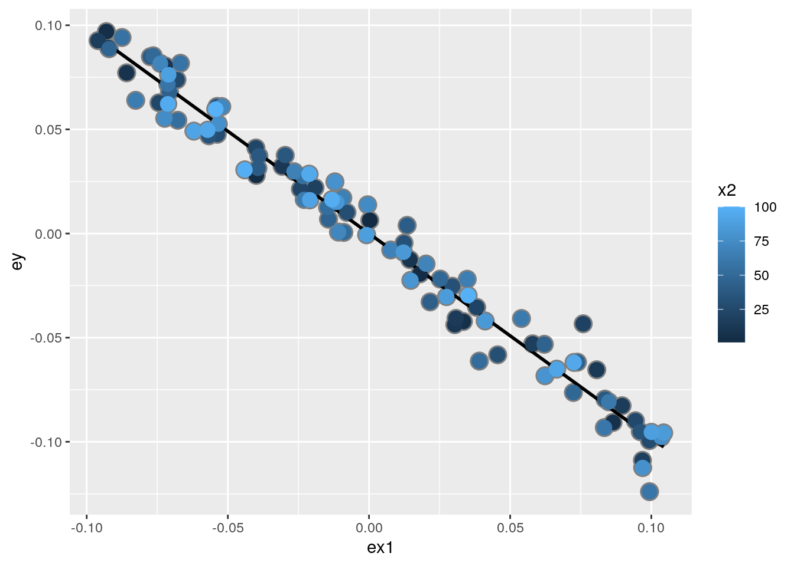
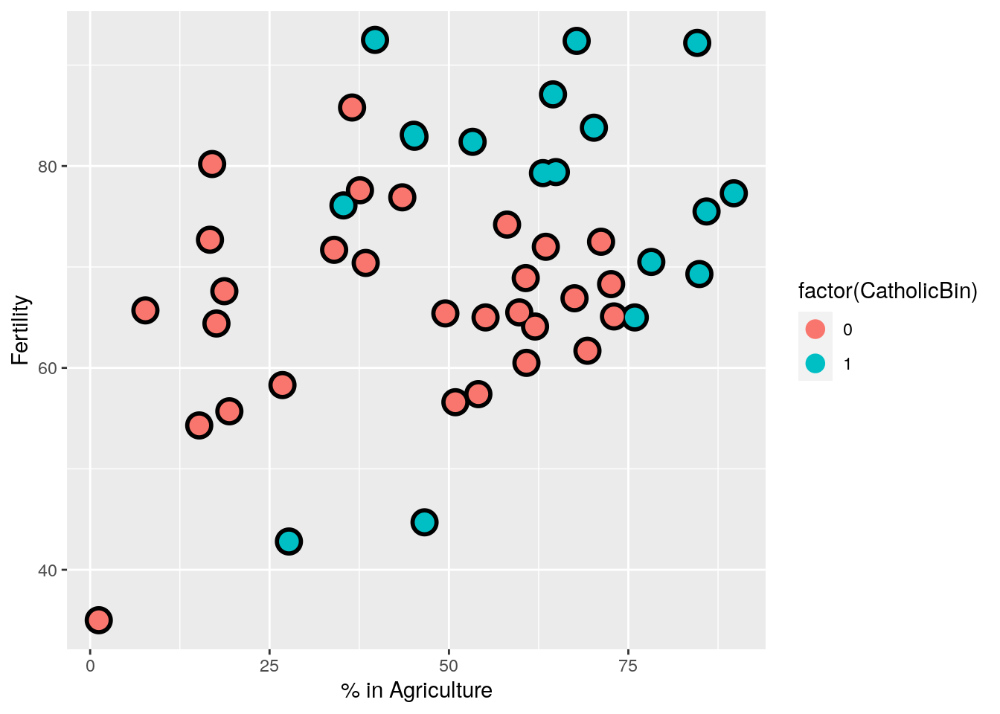
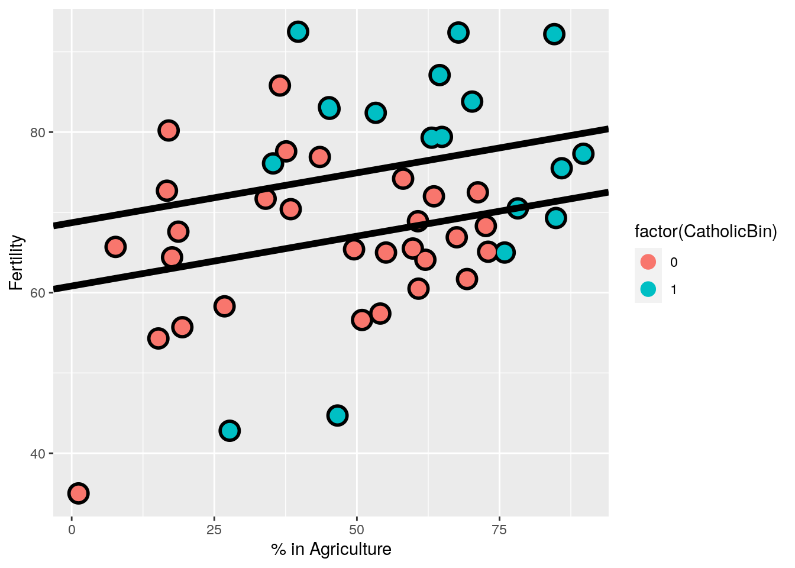
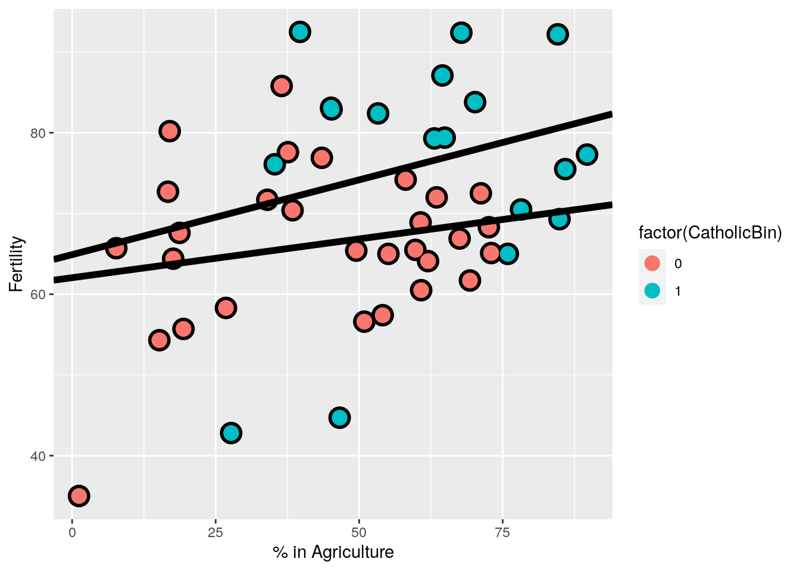
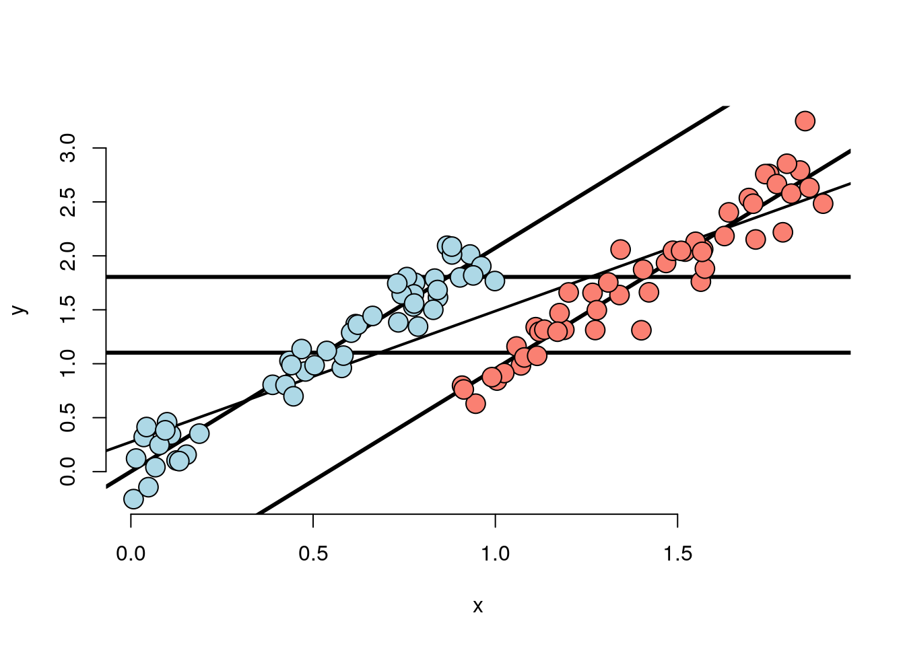
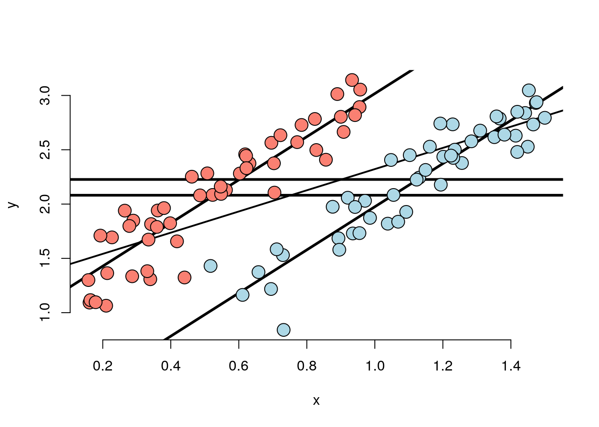
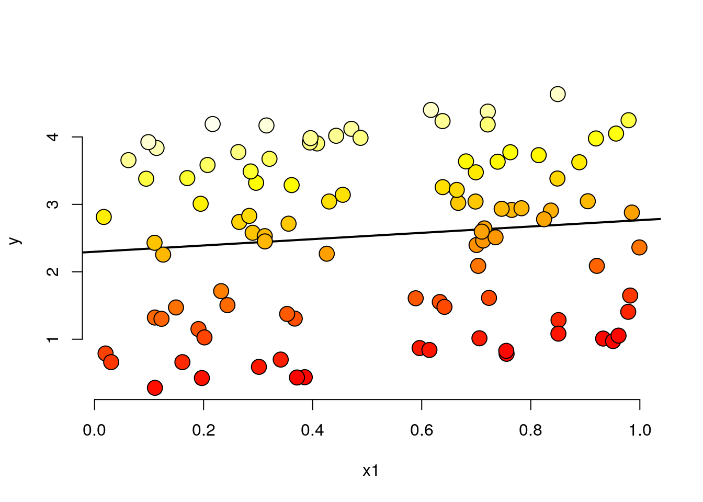
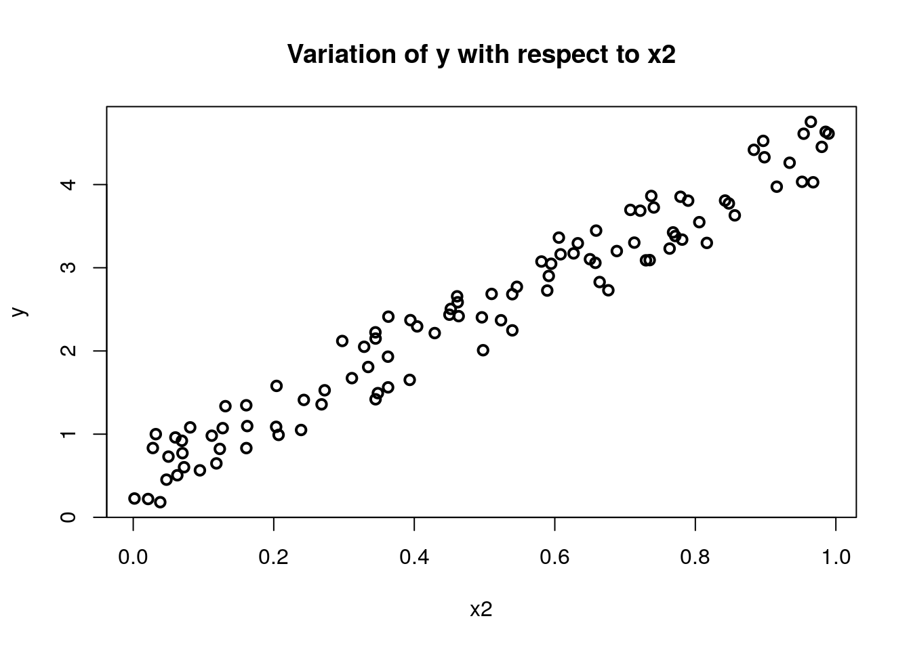
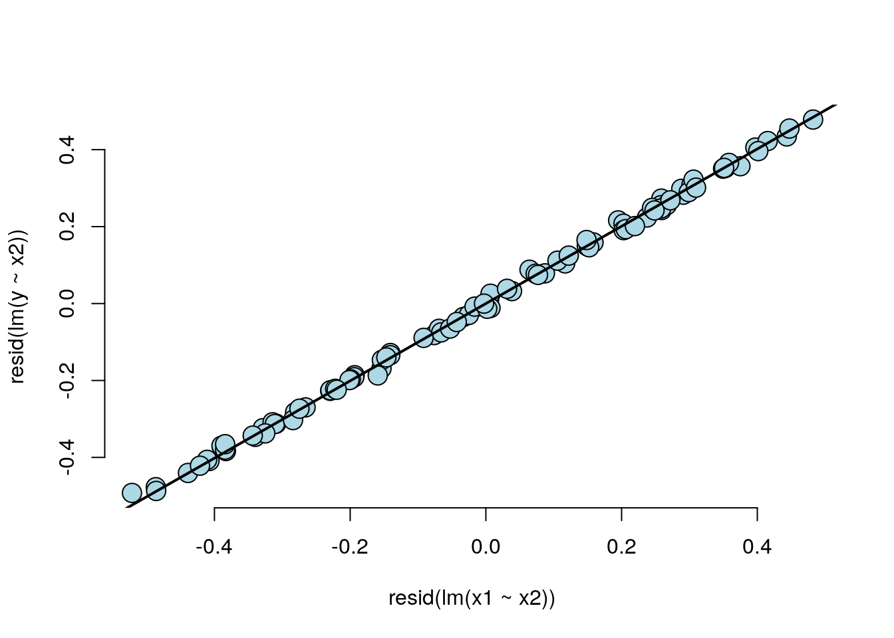

```
## Installing package into '/usr/local/lib/R/site-library'
## (as 'lib' is unspecified)
```

# Week 03

## Multi-variable regression

We now extend linear regression so that our models can contain more variables. A natural first approach is to assume additive effects, basically extending our line to a plane, or generalized version of a plane as we add more variables. Multi-variable regression represents one of the most widely used and successful methods in statistics.  

If you're utilizing predictor X to forecast a response Y and discover a meaningful relationship, there's a potential issue if the predictor hasn't been randomly assigned to the subjects or units being observed. In such cases, there's always a concern that there might be another variable, whether known or unknown, that could account for the observed relationship. For example, imagine if you had a friend who downloaded some data, where they had all sorts of health information from people
and also their dietary information. This person claims to have found an interesting relationship: breath mint usage has a significant regression relationship with forced expiratory volume(FEV), a measure of lung function. You would be skeptical there's very little basis for a biological relationship there. Breath mints are just sugar! But maybe, but what you've really be thinking is what other variables might explain this relationship? You might have two hypotheses: this person dug through lots and lots of variables and just found the one that was significant, and it's just a chance of association, which is the problem of multiplicity. In addition it is likely, you would think the real problem is smokers tend to use more breath mints, and smoking has this relationship with lung function. It's well-established that chronic exposure to a smoker, even second-hand smoke has negative impacts on lung function. So it's probably smoking it probably has nothing to do with the breath mints, it's a indirect effect of breath mints through smoking, not a direct effect of breath mints on lung function. This would be the hypothesis. To establish that there's a breath mint effect beyond smoking we could consider smokers by themselves, and see whether their lung function differs by their breath mint usage, and consider non-smokers by themselves, and see whether their lung function differs by breath mint usage, where we conditioned on smoking status. This way we would compare like with like. Multivariable regression is sort of automated way to do that in a linear fashion. It makes fair enough assumptions, in automated way. In this section we will explain how it works and we will also talk a little bit about its limitations. 

Multivariable regression is trying to look at the relationship of a predictor and a response, while having, at some level, accounted for other variables. Moreover, multivariable regression is actually a good prediction model.
For example, a Kaggle competition wanted to predict the number of days a person would be in the hospital in subsequent years given their claims history and number of days they were in the hospital in previous years. The insurance companies seek to harness an extensive dataset derived from claims, aiming to predict a singular numerical outcome. However, the conventional approach of simple linear regression would be insufficient when confronted with multiple predictors. How can we extend the scope of simple linear regression to accommodate a multitude of regressors for predictive purposes? The procedure is similar to simple linear regression where there's more predictor terms, X values. For example, $X_1$ might be the number of insurance claims in the previous year, and $X_2$ might be whether or not the person had a particular cardiac problem, and so on. The first variable is typically just a constant one, so there's an intercept that's included, a term that's just $\beta_0$ by itself. Interestingly in this competition, we found that multivariable regression could get people very close to the winning entry, while other machine learning methods like random forest, and boosting only improved the results minorly on top of multivariable regression.

Note: in case of breath mint study, one of the predictors, $X_1$ might be breath mint usage (a binary variable), and $X_2$ might be how much a person smoked.

* The general linear model extends simple linear regression (SLR) by adding terms linearly into the model.
$$
Y_i =  \beta_0 X_{0i} + \beta_1 X_{1i} + \ldots +
\beta_{p} X_{pi} + \epsilon_{i} 
= \sum_{k=0}^p X_{ik} \beta_j + \epsilon_{i}
$$
* Where $X_{1i}=1$ typically, the $\beta_j$ are the coefficients of the model.


* Least squares (and hence ML estimates under iid Gaussianity of the errors) minimizes
$$
\sum_{i=1}^n \left(Y_i - \sum_{k=1}^p X_{ki} \beta_j\right)^2
$$
Note, the important linearity is linearity in the coefficients. Thus
$$
Y_i =  \beta_1 X_{1i}^2 + \beta_2 X_{2i}^2 + \ldots +
\beta_{p} X_{pi}^2 + \epsilon_{i} 
$$
is still a linear model. (We've just squared the elements of the predictor variables.)

### How to get the coefficients, derivation of formulas

Here we will go through the derivation of formulas to show how the least squares estimates are obtained. This derivation is not required for the course, but it may be helpful for those who are interested in understanding how the estimates are obtained.

Just to review, if you have regression to the origin, you want a line that's forced to the origin that has no intercepts. You have the single predictor $X$ and a single predictor of $Y$ and you want no intercept, $E[Y_i]=X_{1i}\beta_1$. The slope estimate was $\sum X_i Y_i / \sum X_i^2$. Now lets try to derive the least squares estimate when we have two regressors, which can be generalized to models with more variables. In $E[Y_i] = X_{1i}\beta_1 + X_{2i}\beta_2 = \mu_i$, Least squares tries to minimize:
$$
\sum_{i=1}^n (Y_i - X_{1i} \beta_1 - X_{2i} \beta_2)^2
$$
Here we try to give a development that is more intuitive than what you would get with something like linear algebra. 
$$\Sum(y_i - X_{0i} \beta_0 - X_{1i} \beta_1$$
Imagine we knew $\beta_1$ or fix $\beta_1$, then we can write $\tilde y_i = y_i - x_{0i} \beta_0$ and subsequently $\Sum(\tilde y_i - X_{1i} \beta_1$. This is exactly regression through the origin with just the single regressor. So we can write $\beta_1 = \sum \tilde y_i X_{1i} / \sum X_{1i}^2$. Now we can plug this back into the original equation and we get:
$$
\sum_{i=1}^n (Y_i - X_{1i} \beta_1 - X_{2i} \sum \tilde y_i X_{1i} / \sum X_{1i}^2)^2
$$
This is an equation that only involves $\beta_0$ and a regression through the origin for $\beta_0$. What it works out to be, and this is the interesting part, is that the regression slope for $\beta_0$, is exactly what you would obtain if you took the residual of $X_1$ out of $X_0$, and $X_1$ out of $Y$ and
then just did regression to the origin. 

Multivariable regression calculates the coefficient for $X_0$, $\beta_0$, as if you had removed the effect of $X_1$ from both $Y$ and $X_0$. Similarly, the regression coefficient for $X_1$, $\beta_1$, is what you would get if you were to remove the effect of $X_0$ from both $Y$ and $X_1$. This is why multivariable regression is thought of as having adjusted for the other variables.
A coefficient from a multivariable regression is the coefficient where the linear effect of all the other variables on that predictor and response has been removed.

### Results

In $E[Y_i] = X_{0i}\beta_0 + X_{1i}\beta_1$, we have two covariates, $X_1 , X_2$. 
$$\hat \beta_0 = \frac{\sum_{i=1}^n e_{i, Y | X_1} e_{i, X_0 | X_1}}{\sum_{i=1}^n e_{i, X_0 | X_1}^2}$$

$\beta_0$ is what you would get with regression through the origin if you removed the second coefficient $X_1$. Similarly, the same thing could be said about the coefficient for $X_1 \beta_1$. $\hat \beta_1$ is the linear regression where linear effect of $X_0$ out of both the response $Y$, and the second predictor, $X_1$. This is why multivariable regression relationships are considered as having been adjusted for all the other variables. 

### Example with two variables, simple linear regression

$Y_{i} = \beta_0 X_{0i} + \beta_1 X_{1i}$ where  $X_{0i} = 1$ is an intercept term. Notice the fitted coefficient of $X_{1i}$ on $Y_{i}$ is $\bar Y$. The residuals are $e_{i, Y | X_1} = Y_i - \bar Y$. Thus the fitted coefficient of $X_{1i}$ on $X_{0i}$ is $\bar X_1$, which is the residuals $e_{i, X_0 | X_1}= X_{0i} - \bar X_0$. We can write:
$$
\hat \beta_1 = \frac{\sum_{i=1}^n e_{i, Y | X_0} e_{i, X_1 | X_0}}{\sum_{i=1}^n e_{i, X_1 | X_0}^2} = \frac{\sum_{i=1}^n (X_i - \bar X)(Y_i - \bar Y)}{\sum_{i=1}^n (X_i - \bar X)^2}
= Cor(X, Y) \frac{Sd(Y)}{Sd(X)}
$$

### The general case

More generally, multivariate regression estimates are exactly those having removed the linear relationship of the other variables from both the regressor and response. Least squares solutions have to minimize$$\sum_{i=1}^n (Y_i - X_{1i}\beta_1 - \ldots - X_{pi}\beta_p)^2$$. The least squares estimate for the coefficient of a multivariate regression model is exactly regression through the origin with the linear relationships with the other regressors removed from both the regressor and outcome by taking residuals. In this sense, multivariate regression "adjusts" a coefficient for the linear impact of the other variables. 

### Examples with multiple-variables

In the following simulation we have 100 observations and want to generate three predictors, `x, x2, x3`, where they are all just standard normal. When we write `y = 1 + x + x2 + x3`, all my coefficients are 1, meaning the population model used for simulation, they're all 1. Next we add some random noise, that's the error term. 


```r
n = 100; x = rnorm(n); x2 = rnorm(n); x3 = rnorm(n)
y = 1 + x + x2 + x3 + rnorm(n, sd = .1)
ey = resid(lm(y ~ x2 + x3))
ex = resid(lm(x ~ x2 + x3))
sum(ey * ex) / sum(ex ^ 2)
coef(lm(ey ~ ex - 1))
coef(lm(y ~ x + x2 + x3)) 
```

Here we want to point out, `coef(lm(ey ~ ex - 1))` is the same coefficient as if we regress y on x, x2 and x3, and an intercept `coef(lm(y ~ x + x2 + x3))`. You see the x term here is exactly the same as the regression through the origin estimate with the residuals. 

### Interpretation of coefficients

The regression predictor, given the collection of covariants take a specific value, $x_1$ to $x_p$, is just the sum of the $x_k\beta_k$. $$E[Y | X_1 = x_1, \ldots, X_p = x_p] = \sum_{k=1}^p x_{k} \beta_k$$

If one of the predictors, say $X_1$, is incremented by 1 i.e. $X_1$ instead of $x_1$ takes $x_1+1$, then the regression coefficient $\beta_1$ is the expected change in the response.
$$
E[Y | X_1 = x_1 + 1, \ldots, X_p = x_p] = (x_1 + 1) \beta_1 + \sum_{k=2}^p x_{k} \beta_k
$$

If we subtract the two terms the expected value of the response from the responce where the first co-efficient takes the value of $x_1 +1$ works out to be $\beta_1$. 
$$
E[Y | X_1 = x_1 + 1, \ldots, X_p = x_p]  - E[Y | X_1 = x_1, \ldots, X_p = x_p]$$
$$= (x_1 + 1) \beta_1 + \sum_{k=2}^p x_{k} \beta_k + \sum_{k=1}^p x_{k} \beta_k = \beta_1 $$

Notice all the other $x_2$ to $x_p$ were held fixed, the interpretation of a multivariate regression coefficient is the expected change in the response per unit change in the regressor, holding all of the other regressors fixed. 


The basic components of the linear models are exactly the same as in simple linear regression.

* Model $Y_i = \sum_{k=1}^p X_{ik} \beta_{k} + \epsilon_{i}$ where $\epsilon_i \sim N(0, \sigma^2)$
* Fitted responses $\hat Y_i = \sum_{k=1}^p X_{ik} \hat \beta_{k}$
* Residuals $e_i = Y_i - \hat Y_i$
* Variance estimate $\hat \sigma^2 = \frac{1}{n-p} \sum_{i=1}^n e_i ^2$ (note the $n-p$ degrees of freedom)
* To get predicted responses at new values, $x_1, \ldots, x_p$, simply plug them into the linear model $\sum_{k=1}^p x_{k} \hat \beta_{k}$
* Coefficients have standard errors, $\hat \sigma_{\hat \beta_k}$, and
$\frac{\hat \beta_k - \beta_k}{\hat \sigma_{\hat \beta_k}}$
follows a $T$ distribution with $n-p$ degrees of freedom.
* Predicted responses have standard errors and we can calculate predicted and expected response intervals.

These should all be pretty familiar because they're basically the same as what we did for linear aggression, the difference is we have more terms now. Remember in linear aggression we had two terms, we had an intercept and a covariant now we're just adding more covariants potentially.

One point to note is that the variance estimate is not quite the same as the average squared residuals. In linear regression we divided by $n-2$, now we divide by $n-p$. That's kind of a technical point because if you know $n-p$ of the residuals you implicitly know the last $p$ of them due to some linear constraints. That's a minor point you can think of the residuals variants estimate is nothing other than the average square residuals for the most part with $N-p$ part not withstanding.


In a sense all the things we knew about from linear regression carryover to multi-variable regression. 


To end this section, we want to emphasize how important linear models are to the data scientist. Before you do any machine learning or any complex algorithm, linear models should be your first attempt. They offer parsimonious and well understood easily describe relationships between predictors and response. There are some modern
machine learning algorithms that can beat some of the properties of linear models, like the imposed linearity. Nonetheless, linear models should always be your starting point. There's some amazing things you can do with linear models that you may not think that would be possible. For example, you can take a time series like a music sound or something like that, and decompose it into its harmonics. This is so-called discrete Fourier transform can be thought of the as the fit from a linear model. You can flexibly fit rather complicated functions and curves and things like that using linear models. You can fit factor variables as predictors. ANOVA and ANCOVA are special cases of linear models. You can uncover complex multivariate relationships within a response and you can build fairly accurate prediction models.

## Multi-variable regression tips and tricks

Let's start this discussion with the famous Swiss Fertility Data. Using the following command you can load the data and see the documentation.


```r
require(datasets); 
data(swiss); 
?swiss
```

The data shows standardized fertility measure and socio-economic indicators for each of 47 French-speaking provinces of Switzerland at about 1888. A data frame with 47 observations on 6 variables, each of which is in percent, i.e., in [0, 100]. The variables are:

* [,1]   Fertility          a common standardized fertility measure
* [,2]   Agriculture        % of males involved in agriculture as occupation
* [,3]	 Examination        % draftees receiving highest mark on army examination
* [,4]	 Education          % education beyond primary school for draftees
* [,5]	 Catholic           % catholic (as opposed to protestant)
* [,6]	 Infant.Mortality   live births who live less than 1 year

All variables but Fertility give proportions of the population.

Visualizing some of the basic scatter plots is always a good practice. 


```r
library(GGally)
```

```
## Loading required package: ggplot2
```

```
## Registered S3 method overwritten by 'GGally':
##   method from   
##   +.gg   ggplot2
```

```r
g <- ggpairs(
  swiss,
  lower = list(continuous = "smooth"),
  wrap = function(...) {
    ggally_smooth(..., method = "loess")
  }
)
```

```
## Warning in warn_if_args_exist(list(...)): Extra arguments: 'wrap' are being
## ignored. If these are meant to be aesthetics, submit them using the 'mapping'
## variable within ggpairs with ggplot2::aes or ggplot2::aes_string.
```

```r
g
```


In this plot you see fertility is on the x-axis for all the plots in the first column, agriculture is on the x-axis for all of the plots in the second column. Agriculture is also on the y-axis for the first graph. In addition, the corresponding upper triangular part of the matrix gives the correlation between the two variables. For example, fertility and agriculture the relation turns out to be fairly linear with confidence prediction band around it. The correlation between the two is 0.35. 

Let's investigate the relationship where agriculture, the percent of the province that works in the agricultural industry, with fertility. 


```r
summary(lm(Fertility ~ . , data = swiss))$coefficients
```

```
##                    Estimate  Std. Error   t value     Pr(>|t|)
## (Intercept)      66.9151817 10.70603759  6.250229 1.906051e-07
## Agriculture      -0.1721140  0.07030392 -2.448142 1.872715e-02
## Examination      -0.2580082  0.25387820 -1.016268 3.154617e-01
## Education        -0.8709401  0.18302860 -4.758492 2.430605e-05
## Catholic          0.1041153  0.03525785  2.952969 5.190079e-03
## Infant.Mortality  1.0770481  0.38171965  2.821568 7.335715e-03
```

Tilde period in `lm` function is a shorthand for all the other variables in the data frame. The output of the `summary` function gives the coefficients of the model. The first column gives the estimated coefficients, the second column gives the standard errors of the coefficients, the third column gives the t-statistics, and the fourth column gives the p-values. The p-values are the probability of observing a t-statistic as extreme as the one observed, if the true coefficient were 0.

The number $-0.17$ in the `Agriculture` variable row is interpreted as: we expect a 0.17 decrease, in standardized fertility for every 1% increase in the percentage
of males involved in agriculture, holding the other variables constant. Meaning we hold examination and education, percent Catholic and infant mortality constant. 

The next column, the standard error 0.07, talks about how precise that coefficient is. It talks about the statistical variability of that coefficient. If we wanted to perform a hypothesis test, we would take the estimate, subtract off the hypothesized value, which in this case is zero, and divide it by the standard error of the estimate. Which is the definition of T-statistic. R conveniently provides it to us, -2.448. 


We can calculate the probability of getting a t-statistic as extreme as that. As small as negative 2.448 or smaller, and because we're doing a two-sided test,
we would double that p-value. The degrees of freedom are $n - #coefficients$, including the intercept. But again, R does that on our behalf, and that works out to be 0.018. By standard thresholding rules, type one error rate of say 5%, that would be statistically significant. 

In the following section we will see how the process of model selection changes the estimates. We start by contrasting the model with a model that just has agriculture as predictor, the previous model had all the other variables in this predictor.


```r
summary(lm(Fertility ~ Agriculture, data = swiss))$coefficients
```

```
##               Estimate Std. Error   t value     Pr(>|t|)
## (Intercept) 60.3043752 4.25125562 14.185074 3.216304e-18
## Agriculture  0.1942017 0.07671176  2.531577 1.491720e-02
```

The agriculture variable is about the same magnitude, 0.19 instead of 0.17 but with changed signs. Instead of agriculture having a negative effect on fertility, it has a positive effect on fertility. Adjusting for the other variables changes the actual direction of the effect of agriculture on fertility. This is the impact of something so-called Simpson's Paradox. Notice in both cases the agriculture coefficient is strongly statistically significant. 
We would like to create (via simulation) an example where an effect can reverse itself. It can help us understand Simpson's paradox could happen. 
Keep in mind, regression is a dynamic process, where you have to think about what variables to include and why. If there hasn't been randomization to
protect you from confounding, you have to go through a scientific dynamic process of putting confounders in and out and thinking about what they're
doing to your effective interest in order to evaluate it. 


```r
n <- 100; x2 <- 1 : n; x1 <- .01 * x2 + runif(n, -.1, .1); y = -x1 + x2 + rnorm(n, sd = .01)
plot(x1)
```


```r
summary(lm(y ~ x1))$coef
```

```
##              Estimate Std. Error  t value     Pr(>|t|)
## (Intercept)  1.541863    1.00095  1.54040 1.266858e-01
## x1          94.864140    1.69486 55.97166 3.353361e-76
```

```r
summary(lm(y ~ x1 + x2))$coef
```

```
##                  Estimate   Std. Error      t value      Pr(>|t|)
## (Intercept)  0.0005680538 0.0022163029    0.2563069  7.982566e-01
## x1          -0.9948909569 0.0215079477  -46.2568987  6.596463e-68
## x2           0.9999279772 0.0002209948 4524.6669855 4.719142e-260
```

The second regressor, $x_2$, is the values $1-n$, $x_1$ is a variable that depends on $x_2$ and random noise. Think of $x_2$ as something we might measure regularly, like days, and $x_1$ as something like a saving account where the balance goes up with time and random fluctuations. The random fluctuations impact the spending, so the money doesn't necessarily always just go up. It goes up and down sporadically, but the linear trend is going up. Let's assume y is happiness with a measure like `y = -x1 + x2 + noise`. The true generating model `y` is negatively associated with `-x1` suggesting happiness is negatively associated with money and positively associated with `x2`, so it goes up with time and down with `x1` with some random normal noise. We know from the model `y = -x1 + x2 + noise` the outcome depends negatively on `x1` with a coefficient of minus 1, and depends positively on `x2` with a coefficient of plus 1. If fit `x1` by itself we get an enormous coefficient, 95, which is clearly wrong. It's nothing near to the negative 1 that it's supposed to be or that we would hope it would be. It is picking up the residual effect of `x2` that's a big driver of y, but when we fit the correct model, `x1` and `x2`, together we will get the correct coefficients, about minus 1 for `x1`, and about plus 1 for `x2`. You can imagine why this would happen by answering: what is regression doing? It's taking `x1` and removing the linear effect of `x2`.

Let's do some plots to highlight this, just to show us how it works a little bit.


```r
dat = data.frame(y = y, x1 = x1, x2 = x2, ey = resid(lm(y ~ x2)), ex1 = resid(lm(x1 ~ x2)))
library(ggplot2)
g = ggplot(dat, aes(y = y, x = x1, colour = x2))
g = g + geom_point(colour="grey50", size = 5) + geom_smooth(method = lm, se = FALSE, colour = "black") 
g = g + geom_point(size = 4) 
g
```

```
## `geom_smooth()` using formula 'y ~ x'
```


There is a clear positive linear relationship, between the `x1` and `y`. However, with x2, which is the color, there's also clear positive gradient. As y goes up, so does x2. And also you can see as x1 goes up, so does x2. So you can see the confounding that's happening here.


```r
g2 = ggplot(dat, aes(y = ey, x = ex1, colour = x2))  
g2 = g2 + geom_point(colour="grey50", size = 5) + geom_smooth(method = lm, se = FALSE, colour = "black") + geom_point(size = 4) 
g2
```

```
## `geom_smooth()` using formula 'y ~ x'
```



If we plot the residuals you can see that for the residual y and the residual `x1`, there's a clear negative linear relationship, and if you stare at it enough, you realize that the slope of this line should be around negative 1. You can also see that the `x2` variable is clearly not related to the residual `x1` variable. 

It is important to remember the above explanation doesn't mean that throwing every variable into your regression model is the right thing to do. There's consequences to throwing in unnecessary variables. It can make your model less interpretable, it can make your model less stable, and it can make your model less generalizable. It's important to think about what variables you're putting in and why.

In the earlier example about Swiss data the agriculture effect reversed itself after we included the other variables in the model. You will find that this happens quite a bit when education and examination are included. Educational attainment is negatively correlated with the percent working in agriculture, a correlation of -0.64. In addition, education and examination are kind of measuring the same thing. Their correlation, those two variables is 0.7. The percent of males in the province working in agriculture is negatively related to educational attainment (correlation of -0.6395225) and Education and Examination (correlation of 0.6984153) are obviously measuring similar things. The question is: is the positive marginal an artifact for not having accounted for, say, Education level? (Education does have a stronger effect, by the way.)
At the minimum, anyone claiming that provinces that are more agricultural have higher fertility rates would immediately be open to criticism.

*Notice*
What if we include an unnecessary variable?
Here we introduce `z` which adds no new linear information, since it's a linear combination of variables already included. R just drops terms that are linear combinations of other terms.


```r
z <- swiss$Agriculture + swiss$Education
lm(Fertility ~ . + z, data = swiss)
```

```
## Warning in terms.formula(formula, data = data): 'varlist' has changed (from
## nvar=6) to new 7 after EncodeVars() -- should no longer happen!
```

```
## 
## Call:
## lm(formula = Fertility ~ . + z, data = swiss)
## 
## Coefficients:
##      (Intercept)       Agriculture       Examination         Education  
##          66.9152           -0.1721           -0.2580           -0.8709  
##         Catholic  Infant.Mortality                 z  
##           0.1041            1.0770                NA
```

### Dummy variables are smart
You might be surprised to find out how flexible linear regression models are. For example, you can fit factor variables as regressors and come up with things like
analysis of variance as a special case of linear models. 

Consider the linear model $Y_i = \beta_0 + X_{i1} \beta_1 + \epsilon_{i}$ where each $X_{i1}$ is binary so that it is a 1 if measurement $i$ is in a group and 0 otherwise. (Treated versus not in a clinical trial, for example.) The estimated mean for the treated group is the mean of the people who are treated. Then for people in the treated group we can write $E[Y_i] = \beta_0 + \beta_1$. $\beta_1$ is interpreted as the increase, or decrease if it's negative, in the mean response for those that were treated.
Similarly for people without treatment we have $E[Y_i] = \beta_0$.

The LS fits work out to be $\hat \beta_0 + \hat \beta_1$ is the mean for those in the group and $\hat \beta_0$ is the mean for those not in the group.
You see that linear regression provides the fitted values and tell you about the means for both of the groups, in addition it gives you an inference for comparing the two groups automatically.


**Note** including a binary variable that is 1 for those not in the group would be redundant. It would create three parameters to describe two means.


We can generalize this to more than two groups. If we have a three-level variable, we can create two binary variables, one for each level, and then we can compare the means of the three groups. For example, imagine you have some outcome but you want to compare it to U.S. political party affiliation. In this case, let's say you were only considering those who were Democrats, Republicans, or registered Independents. Well, you can do that by having a variable X1, that's one for Republicans and zero for otherwise, a variable X2 that's one for Democrats and zero for otherwise, we omit the X3 for Independents because of redundancy. If we know that you're not Republican and not a Democrat, then you must be an Independent in our data set the way we've set things up and having a third variable wouldn't have any new information. 
$$Y_i = \beta_0 + X_{i1} \beta_1 + X_{i2} \beta_2 + \epsilon_i$$ 
The mean for the three groups are:
* If $i$ is Republican $E[Y_i] = \beta_0 +\beta_1$
* If $i$ is Democrat $E[Y_i] = \beta_0 + \beta_2$.
* If $i$ is Independent $E[Y_i] = \beta_0$.

If we compare the means like $\beta_0$ the mean for the Independents versus $\beta_0 +\beta_1$ the mean for the Republicans, i.e. subtract those two, we get $\beta_1$. Which means $\beta_1$ compares Republicans to Independents, and similarly $\beta_2$ compares Democrats to Independents and $\beta_1 - \beta_2$ compares Republicans to Democrats. By omitting the regression variable for the Independents, the intercept became the value for the Independents, and all of the other coefficients have become interpreted relative to Independents and shows choice of reference category changes the interpretation. If we had included the regressor for
Independents and excluded the one for Republicans, then the intercept would be for Republicans, and the coefficient in front of the Democratic would be Democrats versus Republicans. The coefficient in front of the Independent would be Independent versus Republican. To illustrate how this works we move to R.
In this example we look at a factor variable and see how R is treating it the dataset is `InsectSprays` and we're going to fit a linear model to it. 


```r
require(datasets);data(InsectSprays); require(stats); require(ggplot2)
g = ggplot(data = InsectSprays, aes(y = count, x = spray, fill  = spray))
g = g + geom_violin(colour = "black", size = 2)
g = g + xlab("Type of spray") + ylab("Insect count")
g
```


`Y` is the count, the number of insects, `X` is the spray. We use a violin plot to show the data, which is kind of like a histogram but sort of tilted on its side and repeated on both sides so it looks a little like a violin. It looks like a violin if you're data cooperates, otherwise, it looks like a blob. As you can see there are eight spray A, B, C, D, E, and F and you can see the insect counts. It's unfortunate they're not telling us whether or not the count is the count of
the number of alive or the number dead insects. So we don't know if this is a better spray or a worse spray. However, we still can test the difference between different factor levels in this case using linear models. Wwhen we include insect spray as a linear model and y as an outcome.


```r
summary(lm(count ~ spray, data = InsectSprays))$coef
```

```
##                Estimate Std. Error    t value     Pr(>|t|)
## (Intercept)  14.5000000   1.132156 12.8074279 1.470512e-19
## sprayB        0.8333333   1.601110  0.5204724 6.044761e-01
## sprayC      -12.4166667   1.601110 -7.7550382 7.266893e-11
## sprayD       -9.5833333   1.601110 -5.9854322 9.816910e-08
## sprayE      -11.0000000   1.601110 -6.8702352 2.753922e-09
## sprayF        2.1666667   1.601110  1.3532281 1.805998e-01
```


We get the Intercept, spray B, spray C, spray D, spray E, and spray F, notice that spray A is conspicuously missing. The idea is that everything here is in comparison with spray A. So, 0.833 is the change in the mean between spray B and spray A. In this case, 14.5 is the mean for spray A. You can double check that by looking at the plot. Spray B seems reasonable affected by a little bit from spray A, whereas spray C looks like it's affected a lot it has a coefficient of $-12$.
If we wanted to compare spray B and spray C we would have to look at $0.833 - (-12.416)$. We wouldn't have a standard error for that comparison immediately. However, that would give us the estimate. 

If we were to take the average count for the sprays, for those with spray A, we would get 14.5 with spray B we would get $14.5 + 0.833$. 
What R does is it picks the spray level that's the lowest alphanumerically, in this case, spray level A, to set as the reference level. Here we like to show you how you can hard code the same model and not rely on R to pick the reference level. 

```r
summary(lm(count ~ 
             I(1 * (spray == 'B')) + I(1 * (spray == 'C')) + 
             I(1 * (spray == 'D')) + I(1 * (spray == 'E')) +
             I(1 * (spray == 'F'))
           , data = InsectSprays))$coef
```

```
##                          Estimate Std. Error    t value     Pr(>|t|)
## (Intercept)            14.5000000   1.132156 12.8074279 1.470512e-19
## I(1 * (spray == "B"))   0.8333333   1.601110  0.5204724 6.044761e-01
## I(1 * (spray == "C")) -12.4166667   1.601110 -7.7550382 7.266893e-11
## I(1 * (spray == "D"))  -9.5833333   1.601110 -5.9854322 9.816910e-08
## I(1 * (spray == "E")) -11.0000000   1.601110 -6.8702352 2.753922e-09
## I(1 * (spray == "F"))   2.1666667   1.601110  1.3532281 1.805998e-01
```

Here `count` is the outcome and we create a variable using the `I` function which performs the operation inside the regression, inside the model statement. We look at the instances where the spray is equal to B then multiply that by 1 to change it from Boolean to numeric and do the same for the other sprays and add them all together. In this example we included all of the sprays except A which means we forced A to be the reference level. The result is identical to R picking the reference level as we expected. 


What happens if we include spray A?

```r
summary(lm(count ~ 
   I(1 * (spray == 'B')) + I(1 * (spray == 'C')) +  
   I(1 * (spray == 'D')) + I(1 * (spray == 'E')) +
   I(1 * (spray == 'F')) + I(1 * (spray == 'A')), data = InsectSprays))$coef
```

```
##                          Estimate Std. Error    t value     Pr(>|t|)
## (Intercept)            14.5000000   1.132156 12.8074279 1.470512e-19
## I(1 * (spray == "B"))   0.8333333   1.601110  0.5204724 6.044761e-01
## I(1 * (spray == "C")) -12.4166667   1.601110 -7.7550382 7.266893e-11
## I(1 * (spray == "D"))  -9.5833333   1.601110 -5.9854322 9.816910e-08
## I(1 * (spray == "E")) -11.0000000   1.601110 -6.8702352 2.753922e-09
## I(1 * (spray == "F"))   2.1666667   1.601110  1.3532281 1.805998e-01
```

Notice it gives an NA in front of the spray A coefficient. We have six means, for six sprays and seven parameters in intercept. 

If we do want the coefficients, instead of being interpreted as levels referenced to a control level be the mean for each of the groups? Well, we can do that by removing the intercept. 


```r
summary(lm(count ~ spray - 1, data = InsectSprays))$coef
```

```
##         Estimate Std. Error   t value     Pr(>|t|)
## sprayA 14.500000   1.132156 12.807428 1.470512e-19
## sprayB 15.333333   1.132156 13.543487 1.001994e-20
## sprayC  2.083333   1.132156  1.840148 7.024334e-02
## sprayD  4.916667   1.132156  4.342749 4.953047e-05
## sprayE  3.500000   1.132156  3.091448 2.916794e-03
## sprayF 16.666667   1.132156 14.721181 1.573471e-22
```

```r
library(dplyr)
```

```
## 
## Attaching package: 'dplyr'
```

```
## The following objects are masked from 'package:stats':
## 
##     filter, lag
```

```
## The following objects are masked from 'package:base':
## 
##     intersect, setdiff, setequal, union
```

```r
summarise(group_by(InsectSprays, spray), mn = mean(count))
```

```
## # A tibble: 6 × 2
##   spray    mn
##   <fct> <dbl>
## 1 A     14.5 
## 2 B     15.3 
## 3 C      2.08
## 4 D      4.92
## 5 E      3.5 
## 6 F     16.7
```

Here `count` is the outcome and spray is the predictor, but we remove the intercept. 
Notice we get a different set of coefficients, one for each spray level. It includes A, B, C, D, E and F without dropping any levels. It can do that because it has six parameters, and six means to work with. The coefficients are exactly equal to the means for each spray in the data. If calculated the means for each spray it would work out to be the same numbers. 

We want to emphasize this model is no different than the previous model that included an intercept, and just the coefficients have a different interpretation. If we add these together, 14.5 and 0.833 from the model with intercept we should get the mean for spray B, which is the case. In the model with the intercept, the intercept is interpreted as the spray A mean and all the coefficients are interpreted as relative to spray A differences from spray A and when we fit the data without the intercept we get the mean for each spray. 
The p values are testing whether or not, A is different from B, and A is different from C, and A is different from D, and so on, whereas the p values from
the model without intercept are testing whether or not those means are different from 0, which is a very different test. We were trying to illustrate how you play around with factor variables in `lm` is very important in terms of how you interpret it. It's not just a conceptual or theoretical thing to worry about it is a very practical thing. What your intercept means changes dramatically depending on what your reference level is.


One more thing that we want to discuss is the idea of re-leveling. You can re-level to have differenct reference level. For example, if you want to compare spray C to spray A, you can re-level the spray variable to have C as the reference level. 


```r
spray2 <- relevel(InsectSprays$spray, "C")
summary(lm(count ~ spray2, data = InsectSprays))$coef
```

```
##              Estimate Std. Error  t value     Pr(>|t|)
## (Intercept)  2.083333   1.132156 1.840148 7.024334e-02
## spray2A     12.416667   1.601110 7.755038 7.266893e-11
## spray2B     13.250000   1.601110 8.275511 8.509776e-12
## spray2D      2.833333   1.601110 1.769606 8.141205e-02
## spray2E      1.416667   1.601110 0.884803 3.794750e-01
## spray2F     14.583333   1.601110 9.108266 2.794343e-13
```

### Summary of the InsectSprays example

* If we treat Spray as a factor, R includes an intercept and omits the alphabetically first level of the factor.
  * All t-tests are for comparisons of Sprays versus Spray A.
  * Empirical mean for A is the intercept.
  * Other group means are the itc plus their coefficient. 
* If we omit an intercept, then it includes terms for all levels of the factor. 
  * Group means are the coefficients. 
  * Tests are tests of whether the groups are different than zero. (Are the expected counts zero for that spray.)
* If we want comparisons between, Spray B and C, say we could refit the model with C (or B) as the reference level. 

**Note** We want to make a few points about the InsectSprays dataset, which we believe is important for the data scientist.

* Counts are bounded from below by 0, violates the assumption of normality of the errors. 
  * Also there are counts near zero, so both the actual assumption and the intent of the assumption are violated.
* Variance does not appear to be constant.
* Perhaps taking logs of the counts would help. 
  * There are 0 counts, so maybe log(Count + 1)
* Also, we'll cover Poisson GLMs for fitting count data.

In this section we go through an example that underlies the topic of so called ANCOVA. In this example we will fit multiple lines with different intercepts and different slopes. We will use the swiss dataset, recall we're trying to model fertilities as a linear function of agriculture, which is the percent of that province that was working in agriculture. 


```r
library(datasets); data(swiss)
head(swiss)
```

```
##              Fertility Agriculture Examination Education Catholic
## Courtelary        80.2        17.0          15        12     9.96
## Delemont          83.1        45.1           6         9    84.84
## Franches-Mnt      92.5        39.7           5         5    93.40
## Moutier           85.8        36.5          12         7    33.77
## Neuveville        76.9        43.5          17        15     5.16
## Porrentruy        76.1        35.3           9         7    90.57
##              Infant.Mortality
## Courtelary               22.2
## Delemont                 22.2
## Franches-Mnt             20.2
## Moutier                  20.3
## Neuveville               20.6
## Porrentruy               26.6
```

If we do `hist(swiss$Catholic)`, notice that it's very bimodal, that's because most provinces are either majority Catholic or majority Protestant, from this time period. 

```r
hist(swiss$Catholic)
```


We now create a catholic, binary variable, which is one if the province is majority catholic, and zero if it's majority protestant. 

```r
library(dplyr); 
swiss = mutate(swiss, CatholicBin = 1 * (Catholic > 50))
```

We can plot the data to see the two groups, the `CatholicBin` factor variable, that's zero for majority Protestant and one for majority Catholic. 

```r
g = ggplot(swiss, aes(x = Agriculture, y = Fertility, colour = factor(CatholicBin)))
g = g + geom_point(size = 6, colour = "black") + geom_point(size = 4)
g = g + xlab("% in Agriculture") + ylab("Fertility")
g
```




For the time being, we will ignore the outlaiers and simply work on fitting a line where we want two separate lines. One for the majority Catholic provinces, and one for the majority Protestant provinces. For notations `Y` is fertility, `X1` is the percent of the province working in agriculture, and `X2` is a binary variable, where it is one if the province is over 50% catholic, and zero if the province is majority Protestant. Let's consider model one, where we modeled the expected y, given x1 and x2, is an intercept plus a slope times x1. $E[Y | X_1 = x_1, X_2 = 0] = \beta_0 + \beta_1 x_1$. This is the line that would disregard the religion of the province entirely. Let's consider a second model $E[Y | X_1 = x_1, X_2 = 1] = \beta_0 + \beta_1 x_1 + \beta_2 x_2$. 
In the event that X two is equal to zero, i.e. if the province is majority protestant, this works out to be $\beta_0 + \beta_1 x_1$. In the event that x2 is equal to one, i.e. if the province is majority Catholic, this works out to be $\beta_0 + \beta_2 + \beta_1 x_1$.


The model that includes X1 and X2, but no interaction fits two models that have the same slope, but they have different intercepts, $\beta_0$ and then $\beta_0+\beta_2$. If we consider one third model $E[Y | X_1 = x_1, X_2 = 1] = \beta_0 + \beta_1 x_1 + \beta_2 x_2 + \beta_3 x_1 x_2$, in this model when X2 is zero, it works out to be $\beta_0 + \beta_1 x_1$, and when X2 is 1, which is the case when the province is majority Catholic, we get $\beta_0 + \beta_2 + \beta_1 x_1 + \beta_3 x_1$, now let's reorganize terms to get $\beta_0 + \beta_2 + (\beta_1 + \beta_3) x_1$. 

This model is showing if we omitted that interaction term, we fit two lines the same slope, if we include the interaction term, we get two lines different slopes and different intercepts. And the coefficient in front of the Catholic term is going to change in the intercept going from Protestant to Catholic.

### Exploring the models in R

We start by fitting the model, where we fit the expected fertility as a linear function of the percent of the province working in agriculture. 

```r
fit = lm(Fertility ~ Agriculture, data = swiss)
g1 = g
g1 = g1 + geom_abline(intercept = coef(fit)[1], slope = coef(fit)[2], size = 2)
g1
```


Here we want to save the plot in `g1`, then we can keep adding different things to it. The coefficients summaries can be obtained by `summary(fit)$coef`.

```r
summary(lm(Fertility ~ Agriculture + factor(CatholicBin), data = swiss))$coef
```

```
##                        Estimate Std. Error   t value     Pr(>|t|)
## (Intercept)          60.8322366  4.1058630 14.815944 1.032493e-18
## Agriculture           0.1241776  0.0810977  1.531210 1.328763e-01
## factor(CatholicBin)1  7.8843292  3.7483622  2.103406 4.118221e-02
```

This just disregards the color of the points. Let's do one that fits two parallel lines.

```r
fit = lm(Fertility ~ Agriculture + factor(CatholicBin), data = swiss)
g1 = g
g1 = g1 + geom_abline(intercept = coef(fit)[1], slope = coef(fit)[2], size = 2)
g1 = g1 + geom_abline(intercept = coef(fit)[1] + coef(fit)[3], slope = coef(fit)[2], size = 2)
g1
```



Because the variable `CatholicBin` is 0 or 1, we don't actually have to have the factor statement. Because coding a variable of 0 versus 1 treats it as a factor. However we like to call factor variables and the reason is sometimes you have a variable like 0,1,2 for a 3 level variable, and if you don't call that a factor, R is going to treat that as a continuous regressor. It's going to say 2 is twice 1, even if 2 is just a numeric coding for representing red hair color and 1 is for brown hair color, where 2 really has nothing to do with being twice 1 in that case. 


```r
summary(lm(Fertility ~ Agriculture * factor(CatholicBin), data = swiss))$coef
```

```
##                                     Estimate  Std. Error    t value
## (Intercept)                      62.04993019  4.78915566 12.9563402
## Agriculture                       0.09611572  0.09881204  0.9727127
## factor(CatholicBin)1              2.85770359 10.62644275  0.2689238
## Agriculture:factor(CatholicBin)1  0.08913512  0.17610660  0.5061430
##                                      Pr(>|t|)
## (Intercept)                      1.919379e-16
## Agriculture                      3.361364e-01
## factor(CatholicBin)1             7.892745e-01
## Agriculture:factor(CatholicBin)1 6.153416e-01
```
We have an intercept and a slope, this intercept is the intercept for mostly Protestant provinces, the slope is the slope for mostly Protestant provinces. This 2.86 plus 62.04 is the intercept for the mostly Catholic provinces and the slope 0.096 + 0.089 is the slope for the mostly Catholic provinces. For lines with different intercepts and different slopes depending on the percent of the province that is Catholic, put an asterisk and do the fit. What happens when you add an asterisks in between two variables in R? It automatically fits the interaction. In general you want to include the main effects, if you include the interaction. 

```r
fit = lm(Fertility ~ Agriculture * factor(CatholicBin), data = swiss)
g1 = g
g1 = g1 + geom_abline(intercept = coef(fit)[1], slope = coef(fit)[2], size = 2)
g1 = g1 + geom_abline(intercept = coef(fit)[1] + coef(fit)[3], 
                          slope = coef(fit)[2] + coef(fit)[4], size = 2)
g1
```


based on the coefficients all the Catholic terms were positive the line with the slightly higher intercept is the Catholic line and the line for the slightly lower
intercept is the mostly Protestant. Now you can probably see that well for the blue dots it is not clear how the two outlier blue dots impacting the fit, so we might want to investigate that. We will do that in the next section where we talk about residuals and influence diagnostics and that sort of thing. 

## Adjustment

Adjustment, is the idea of putting regressors into a linear model to investigate the role of a third variable on the relationship between another two. Since it is often the case that a third variable can distort, or confound if you will, the relationship between two others.

As an example, consider looking at lung cancer rates and breath mint usage. For the sake of completeness, imagine if you were looking at forced expiratory volume (a measure of lung function) and breath mint usage. If you found a statistically significant regression relationship, it wouldn’t be wise to rush off to the newspapers with the headline “Breath mint usage causes shortness of breath!”, for a variety of reasons. First off, even if the association is sound, you don’t know that it’s causal. But, more importantly in this case, the likely culprit is smoking habits. Smoking rates are likely related to both breath mint usage rates and lung function. How would you defend your finding against the accusation that it’s just variability in smoking habits?

If your finding held up among non-smokers and smokers analyzed separately, then you might have something. In other words, people wouldn’t even begin to believe this finding unless it held up while holding smoking status constant. That is the idea of adding a regression variable into a model as adjustment. The coefficient of interest is interpreted as the effect of the predictor on the response, holding the adjustment variable constant.

In this lecture, we’ll use simulation to investigate how adding a regressor into a model addresses the idea of adjustment.

### Adjustment Examples

In this section, we're gonna go over some examples of how adjusting for one variable can impact the apparent relationship of another variable on an outcome. The easiest way to see this is to look at a two group variable. For example, a treatment versus a control or something you might see in an AB test when we're adjusting for a continuous variable. Here's the first simulation: 

```r
n <- 100; t <- rep(c(0, 1), c(n/2, n/2)); x <- c(runif(n/2), runif(n/2));
beta0 <- 0; beta1 <- 2; tau <- 1; sigma <- .2
y <- beta0 + x * beta1 + t * tau + rnorm(n, sd = sigma)
plot(x, y, type = "n", frame = FALSE)
abline(lm(y ~ x), lwd = 2)
abline(h = mean(y[1 : (n/2)]), lwd = 3)
abline(h = mean(y[(n/2 + 1) : n]), lwd = 3)
fit <- lm(y ~ x + t)
abline(coef(fit)[1], coef(fit)[2], lwd = 3)
abline(coef(fit)[1] + coef(fit)[3], coef(fit)[2], lwd = 3)
points(x[1 : (n/2)], y[1 : (n/2)], pch = 21, col = "black", bg = "lightblue", cex = 2)
points(x[(n/2 + 1) : n], y[(n/2 + 1) : n], pch = 21, col = "black", bg = "salmon", cex = 2)
```


In this case, the red group was the group reciving treatment and the blue group was control. The horizontal lines show the marginal effect of group status disregarding the x. The y was a measure of blood pressure, then we would think that if we hadn't factored in x, the mean for the group that received the treatment was around 2 and the mean for the control was around 0.8. You notice there's a pretty clear linear relationship between the outcome and the regressor. So what we could do is fit a model that looks like $y = \beta_0 + \beta_1 T + \beta_2 x + \epsilon$, where $T$ is the treatment indicator, with values of $\{0,1\}$. This would fit two parallel lines with $\beta_1$ representing the change in intercepts between the groups and $\beta_2$ the common slope that exists across the two groups. 


Taking a closer look at y-axis shows the marginal effect, the effect that we have if we disregard x, and the effect that we have if we incorporate x in a linear model and look at the change in the intercepts, are about the same. In addition, note in this example there is a lot of direct evidence to compare the groups for
any given value of x. If we binned x we would have red and blue circles for a direct comparison of the treatment for kind of a fairly isolated level of x.

Let's try a setting where it's gonna make a big difference. 

```r
n <- 100; t <- rep(c(0, 1), c(n/2, n/2)); x <- c(runif(n/2), 1.5 + runif(n/2));
beta0 <- 0; beta1 <- 2; tau <- 0; sigma <- .2
y <- beta0 + x * beta1 + t * tau + rnorm(n, sd = sigma)
plot(x, y, type = "n", frame = FALSE)
abline(lm(y ~ x), lwd = 2)
abline(h = mean(y[1 : (n/2)]), lwd = 3)
abline(h = mean(y[(n/2 + 1) : n]), lwd = 3)
fit <- lm(y ~ x + t)
abline(coef(fit)[1], coef(fit)[2], lwd = 3)
abline(coef(fit)[1] + coef(fit)[3], coef(fit)[2], lwd = 3)
points(x[1 : (n/2)], y[1 : (n/2)], pch = 21, col = "black", bg = "lightblue", cex = 2)
points(x[(n/2 + 1) : n], y[(n/2 + 1) : n], pch = 21, col = "black", bg = "salmon", cex = 2)
```


The horizontal lines show marginal difference between the red, treated group, and the blue, control group. However, if we fit that model and look at the change in the intercepts, we'd see a tiny difference. This is a case where we would go from a massive treatment effect to nothing when we accounted for x. Moreover, if we knew that the x value was one or smaller, we know that value is in the blue group, and if it was 1.5 or higher, we know the value was in the treated group. So knowledge of x at some level pretty much gives us perfect knowledge of received treatment. In a randomized setuation it would be very hard to pick what treatment you had based on your x level because the x levels were all jumbled up some of the high x levels went to the treated, some of the high x levels went to the control. However, in this case, we clearly didn't randomize. The question of which model here is the right one to consider is not the discussion for this section, here we want to show how the inclusion of x can change the estimate. 
As an example, imagin y, your outcome, was the blood pressure and the x variable was cholesterol or something highly related to whether or not you would've gotten prescribed a medication. You could see that adjusting for x is really just adjusting for the same thing that would lead you to have treatment. Again, this is what makes observational data analysis very hard as opposed to instances where you have randomized sample. This is an example where we had a strong marginal effect when we disregarded x, and a very subtle or a non-existent effect when we accounted for x. One more point is there is no value of x we can hold constant and compare red versus blue directly, which is a bad setting, where we're relying very heavily on the model to compare the group.

A summary of the important points about the previous example can be listed as: 
* The X variable is highly related to group status
* The X variable is related to Y, the intercept doesn't depend on the group variable.
  * The X variable remains related to Y holding group status constant
* The group variable is marginally related to Y disregarding X.
* The model would estimate no adjusted effect due to group.
  * There isn't any data to inform the relationship between group and Y.
  * This conclusion is entirely based on the model.


Another senario is where there is some overlap between data point. 

```r
n <- 100; t <- rep(c(0, 1), c(n/2, n/2)); x <- c(runif(n/2), .9 + runif(n/2));
beta0 <- 0; beta1 <- 2; tau <- -1; sigma <- .2
y <- beta0 + x * beta1 + t * tau + rnorm(n, sd = sigma)
plot(x, y, type = "n", frame = FALSE)
abline(lm(y ~ x), lwd = 2)
abline(h = mean(y[1 : (n/2)]), lwd = 3)
abline(h = mean(y[(n/2 + 1) : n]), lwd = 3)
fit <- lm(y ~ x + t)
abline(coef(fit)[1], coef(fit)[2], lwd = 3)
abline(coef(fit)[1] + coef(fit)[3], coef(fit)[2], lwd = 3)
points(x[1 : (n/2)], y[1 : (n/2)], pch = 21, col = "black", bg = "lightblue", cex = 2)
points(x[(n/2 + 1) : n], y[(n/2 + 1) : n], pch = 21, col = "black", bg = "salmon", cex = 2)
```



There is some direct evidence for comparing the two groups. The marginal mean for the red and blue groups suggests the red is higher than the blue. However, the linear fit in the intercepts shows the blue is higher than the red. This shows the adjusted estimate is significant and the exact opposite of the unadjusted estimate. This phenomenon is often called Simpson's Paradox, and the idea is things can change to the exact opposite when you perform adjustment. 

Next senario is shown in the following plot. 

```r
n <- 100; t <- rep(c(0, 1), c(n/2, n/2)); x <- c(.5 + runif(n/2), runif(n/2));
beta0 <- 0; beta1 <- 2; tau <- 1; sigma <- .2
y <- beta0 + x * beta1 + t * tau + rnorm(n, sd = sigma)
plot(x, y, type = "n", frame = FALSE)
abline(lm(y ~ x), lwd = 2)
abline(h = mean(y[1 : (n/2)]), lwd = 3)
abline(h = mean(y[(n/2 + 1) : n]), lwd = 3)
fit <- lm(y ~ x + t)
abline(coef(fit)[1], coef(fit)[2], lwd = 3)
abline(coef(fit)[1] + coef(fit)[3], coef(fit)[2], lwd = 3)
points(x[1 : (n/2)], y[1 : (n/2)], pch = 21, col = "black", bg = "lightblue", cex = 2)
points(x[(n/2 + 1) : n], y[(n/2 + 1) : n], pch = 21, col = "black", bg = "salmon", cex = 2)
```




Here there is no marginal effect. However, there's a huge effect when we adjust for x. There's no simple rule that says this is always what will happen with adjustment. Pretty much any permutation of going from significant to non-significant, staying both significant, staying non-significant, flipping signs can occur. 

As our final example we look at the following graph.

```r
n <- 100; t <- rep(c(0, 1), c(n/2, n/2)); x <- c(runif(n/2, -1, 1), runif(n/2, -1, 1));
beta0 <- 0; beta1 <- 2; tau <- 0; tau1 <- -4; sigma <- .2
y <- beta0 + x * beta1 + t * tau + t * x * tau1 + rnorm(n, sd = sigma)
plot(x, y, type = "n", frame = FALSE)
abline(lm(y ~ x), lwd = 2)
abline(h = mean(y[1 : (n/2)]), lwd = 3)
abline(h = mean(y[(n/2 + 1) : n]), lwd = 3)
fit <- lm(y ~ x + t + I(x * t))
abline(coef(fit)[1], coef(fit)[2], lwd = 3)
abline(coef(fit)[1] + coef(fit)[3], coef(fit)[2] + coef(fit)[4], lwd = 3)
points(x[1 : (n/2)], y[1 : (n/2)], pch = 21, col = "black", bg = "lightblue", cex = 2)
points(x[(n/2 + 1) : n], y[(n/2 + 1) : n], pch = 21, col = "black", bg = "salmon", cex = 2)
```


This example considers an instance where assuming the slopes were common across the two groups would be wrong. The linear model $y = \beta_0 + \beta_1 T + \beta_2 x + \beta_3 T x + \epsilon$ would fit two lines with different intercepts and different slopes. Another important thing to ascertain is there is no treatment effect. 

If we look at the center there is no evidence of a treatment effect, if we look at the right side of the graph there is a big evidence that blue has a higher outcome than red, and if you look at the left side we see there is a lot of evidence that red has a higher outcome than blue. The interaction is the reason why the main treatment effect doesn't have a lot of meaning and the coefficient in front of the treated effects is not interpreted as the treatment effect by itself. The treatment effect depends on what level of x you're at, and you can't just read the term from the regression output associated with the treatment and act as if it's a treatment effect because we have an interaction term in the model. Again this shows how adjustment can really change things if you have a setting where you have not just adjustment, but so-called modification.

We want to reiterate that nothing we've talked about is specific to having a binary treatment and a continuous x. 

```r
p <- 1
n <- 100; x2 <- runif(n); x1 <- p * runif(n) - (1 - p) * x2
beta0 <- 0; beta1 <- 1; tau <- 4 ; sigma <- .01
y <- beta0 + x1 * beta1 + tau * x2 + rnorm(n, sd = sigma)
plot(x1, y, type = "n", frame = FALSE)
abline(lm(y ~ x1), lwd = 2)
co.pal <- heat.colors(n)
points(x1, y, pch = 21, col = "black", bg = co.pal[round((n - 1) * x2 + 1)], cex = 2)
```



The above plot shows outcome, y, and the continuous variable $x1$ and continuous variable $x2$ color coded, higher lighter values mean higher, and more red darker values means lower. At first glance you might say there is not much of a relationship between y and x1, however, if we look at it in three dimensions you can see that most of the variation of y is explained by its relationship with x2. Here we show the 2D plot of y versus x2. 


An easy way to look at the other variables effect without having to resort to three dimensional plots, which don't work if you move beyond two variables is to look at residuals. 

```r
plot(resid(lm(x1 ~ x2)), resid(lm(y ~ x2)), frame = FALSE, col = "black", bg = "lightblue", pch = 21, cex = 2)
abline(lm(I(resid(lm(x1 ~ x2))) ~ I(resid(lm(y ~ x2)))), lwd = 2)
```



Here we show the residual of y after having removed x2, the linear effect of x2, and the residual of x1 having removed linear effect of x2. As you can see there's
a very strong relationship left over between y and x1 after having removed the effect of x2. 

We want to reiterate we haven't said what exactly is the right model, the best way to think about that is you have to bring in some of the specific subject matter, or clinical scientific subject matter expertise into your model building exercise. If you're doing model building with a regular data set where you want interpretable
coefficients getting the team of people some with the right scientific expertise, some with the statistical expertise, and some with the computing expertise is essential.

## Residuals again

Recall from before that the vertical distances between the observed data points and the fitted regression line are called residuals. We can generalize this idea to the vertical distances between the observed data and the fitted surface in multivariable settings.  


## Model selection


## Practical R Exercises in swirl
During this week of the course you should complete the following lessons in the Regression Models swirl course:

1. MultiVar Examples2
2. MultiVar Examples3
3. Residuals Diagnostics and Variation

## Week 3 Quiz


## (OPTIONAL) Practice exercise in regression modeling


